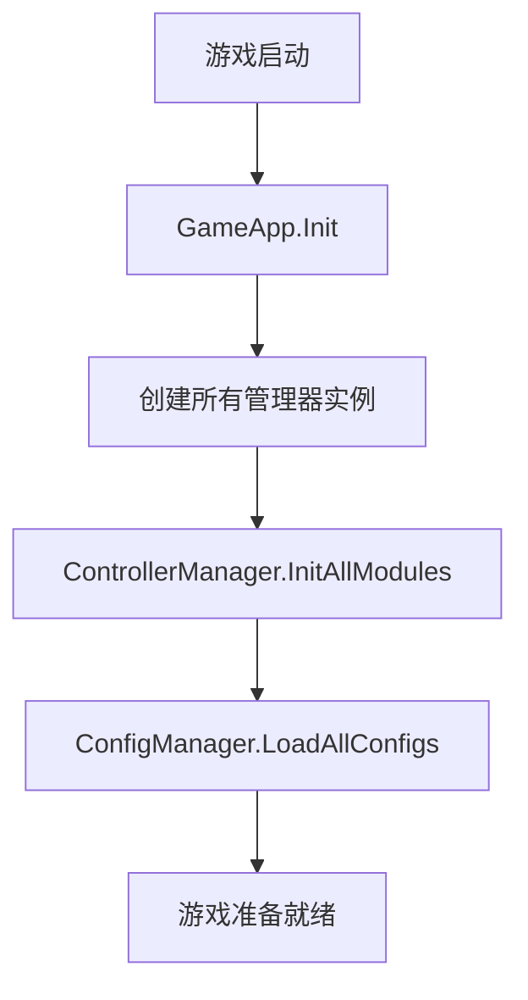

# 2. 核心管理系统

## 2.1 GameApp - 应用入口

### 2.1.1 设计目的
`GameApp` 作为整个游戏的入口点，负责统一管理和初始化所有核心管理器，确保各个系统按照正确的顺序启动和运行。

### 2.1.2 核心管理器列表

```csharp
public static SoundManager SoundManager;        // 音效管理
public static ControllerManager ControllerManager; // 控制器管理
public static ViewManager ViewManager;          // 视图管理
public static ConfigManager ConfigManager;      // 配置管理
public static CameraManager CameraManager;      // 相机管理
public static EventCenter EventCenter;          // 事件中心
public static TimeManager TimeManager;          // 时间管理
public static FightManager FightManager;        // 战斗管理
public static MapManager MapManager;            // 地图管理
public static GameDataManager GameDataManager;  // 游戏数据
public static UserInputManager UserInputManager; // 用户输入
public static CommandManager CommandManager;    // 命令管理
public static SkillManager SkillManager;        // 技能管理
```

### 2.1.3 初始化流程

```csharp
public override void Init()
{
    // 管理器初始化顺序很重要，存在依赖关系
    SoundManager = new();
    ControllerManager = new();
    ViewManager = new();
    ConfigManager = new();
    CameraManager = new();
    EventCenter = new();
    TimeManager = new();
    FightManager = new();
    MapManager = new();
    GameDataManager = new();
    UserInputManager = new();
    CommandManager = new();
    SkillManager = new();
}
```

### 2.1.4 更新循环

```csharp
public override void Update(float dt)
{
    UserInputManager.Update();      // 处理用户输入
    TimeManager.OnUpdate(dt);       // 更新时间系统
    FightManager.Update(dt);        // 更新战斗逻辑
    CommandManager.Update(dt);      // 更新命令执行
    SkillManager.Update(dt);        // 更新技能系统
}
```

## 2.2 单例模式设计

### 2.2.1 Singleton<T> 基类

```csharp
public class Singleton<T>
{
    private static readonly T instance = Activator.CreateInstance<T>();
    public static T Instance { get { return instance; } }

    public virtual void Init() { }
    public virtual void Update(float dt) { }
    public virtual void OnDestroy() { }
}
```

### 2.2.2 设计特点

1. **懒加载**：使用静态构造函数确保线程安全
2. **继承支持**：所有管理器继承自对应基类
3. **生命周期管理**：提供Init、Update、OnDestroy虚方法

### 2.2.3 使用示例

```csharp
public class GameApp : Singleton<GameApp>
{
    // 通过GameApp.Instance访问
}
```

## 2.3 管理器初始化流程

### 2.3.1 启动顺序



### 2.3.2 依赖关系分析

| 管理器 | 依赖项 | 被依赖项 | 初始化顺序 |
|-------|-------|---------|-----------|
| EventCenter | 无 | 所有管理器 | 1 |
| ConfigManager | 无 | GameDataManager | 2 |
| ControllerManager | 无 | ViewManager | 3 |
| ViewManager | ControllerManager | UI模块 | 4 |
| FightManager | MapManager, EventCenter | 战斗模块 | 5 |
| MapManager | 无 | FightManager | 3 |

### 2.3.3 管理器职责划分

#### 核心系统管理器
- **GameApp**：应用总入口，协调所有管理器
- **EventCenter**：全局事件通信
- **TimeManager**：游戏时间控制
- **ConfigManager**：配置数据管理

#### 功能模块管理器
- **FightManager**：战斗逻辑管理
- **MapManager**：地图数据管理
- **SkillManager**：技能系统管理
- **CommandManager**：命令执行管理

#### UI系统管理器
- **ControllerManager**：控制器生命周期管理
- **ViewManager**：视图创建和销毁管理

#### 输入输出管理器
- **UserInputManager**：用户输入处理
- **SoundManager**：音效播放管理
- **CameraManager**：相机控制管理

## 2.4 管理器间通信机制

### 2.4.1 直接调用
```csharp
// 通过GameApp直接访问
GameApp.FightManager.EnterFight();
```

### 2.4.2 事件通信
```csharp
// 通过EventCenter进行松耦合通信
GameApp.EventCenter.AddEvent("FightStart", OnFightStart);
GameApp.EventCenter.BroadcastEvent("FightStart", data);
```

### 2.4.3 控制器间通信
```csharp
// 通过ControllerManager协调
GameApp.ControllerManager.ApplyFunc(controllerKey, "MethodName", args);
```

## 2.5 性能考虑

### 2.5.1 内存管理
- 管理器实例常驻内存
- 使用对象池管理频繁创建销毁的对象
- 及时清理不需要的事件监听

### 2.5.2 更新优化
- 只更新活跃的管理器
- 使用对象池减少GC压力
- 批量处理更新逻辑

### 2.5.3 加载策略
- 同步加载核心管理器
- 异步加载配置数据
- 延迟初始化非关键系统

## 2.6 扩展性设计

### 2.6.1 新管理器添加
```csharp
// 1. 创建管理器类
public class NewManager : Singleton<NewManager>
{
    public override void Init() { /* 初始化逻辑 */ }
    public override void Update(float dt) { /* 更新逻辑 */ }
}

// 2. 在GameApp中注册
public static NewManager NewManager;

// 3. 在Init方法中初始化
NewManager = new();
```

### 2.6.2 管理器接口规范

```csharp
public interface IManager
{
    void Initialize();
    void Update(float deltaTime);
    void Destroy();
    void Reset();
}
```

## 总结

核心管理系统是整个游戏架构的基础，通过统一的单例模式和清晰的管理器划分，确保了系统的稳定性、可维护性和可扩展性。GameApp作为总协调者，负责所有管理器的生命周期管理，为上层业务逻辑提供了可靠的基础设施支持。