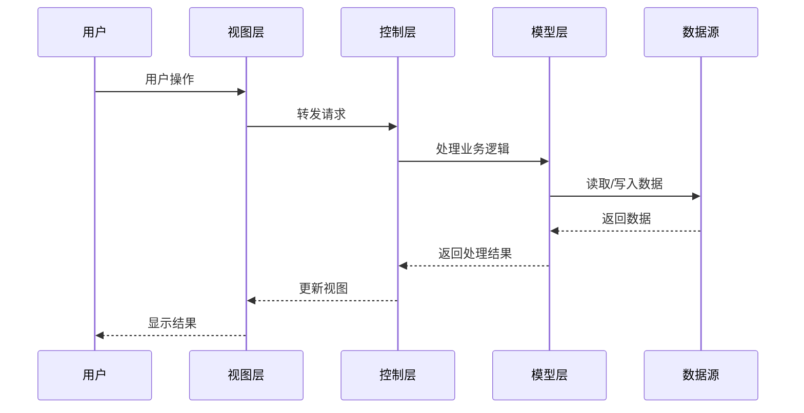
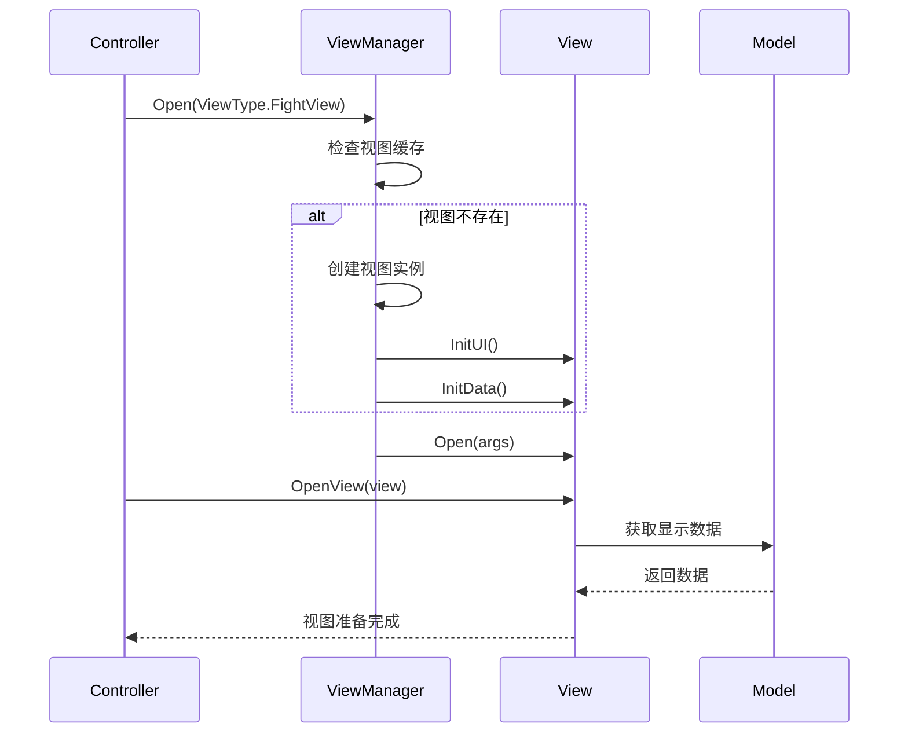
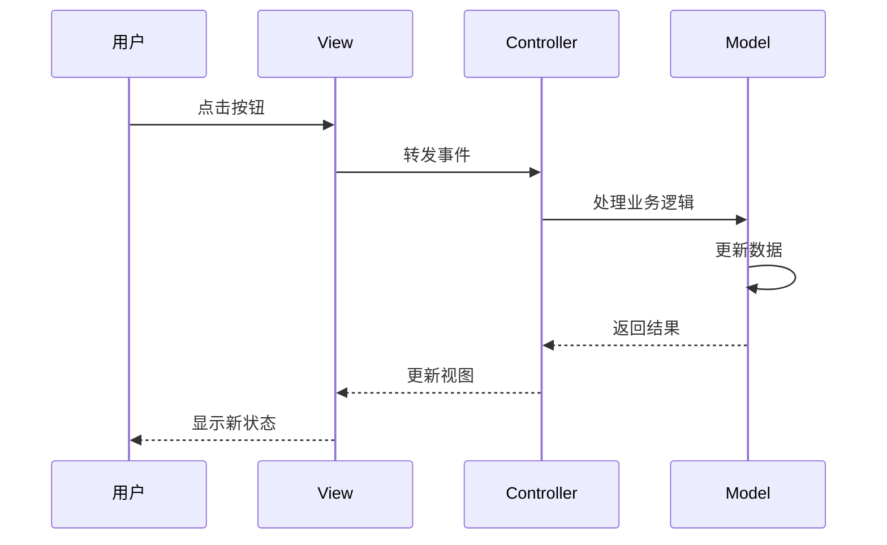

# 3. MVC架构设计

## 3.1 MVC模式实现

### 3.1.1 架构概述
本项目采用MVC（Model-View-Controller）架构模式，将游戏逻辑分为三个层次：
- **Model**：数据模型层，负责数据管理和业务逻辑
- **View**：视图层，负责UI显示和用户交互
- **Controller**：控制层，负责协调Model和View

### 3.1.2 MVC层次关系


### 3.1.3 数据流向



## 3.2 ControllerManager - 控制器管理

### 3.2.1 核心功能

```csharp
public class ControllerManager
{
    private Dictionary<int, BaseController> _modules; // 存储控制器的字典

    // 控制器注册和注销
    public void Register(ControllerType controllerType, BaseController ctl);
    public void UnRegister(int controllerKey);

    // 控制器生命周期管理
    public void InitAllModules();
    public void ClearAllModules();

    // 控制器间通信
    public void ApplyFunc(int controllerKey, string eventName, params object[] args);

    // 获取控制器数据
    public BaseModel GetControllerModel(int controllerKey);
}
```

### 3.2.2 控制器类型定义

```csharp
public enum ControllerType
{
    GameController = 1,      // 游戏主控制器
    FightController = 2,     // 战斗控制器
    LevelController = 3,     // 关卡控制器
    LoadController = 4,      // 加载控制器
    GameUIController = 5,    // UI控制器
}
```

### 3.2.3 控制器基类设计

```csharp
public class BaseController
{
    protected BaseModel _model; // 关联的数据模型

    // 生命周期方法
    public virtual void Init() { }
    public virtual void Destroy() { }
    public virtual void Reset() { }

    // 视图管理方法
    public virtual void OnLoadView(IBaseView view) { }
    public virtual void OpenView(IBaseView view) { }
    public virtual void CloseView(IBaseView view) { }

    // 事件处理方法
    public virtual void ApplyFunc(string eventName, params object[] args) { }

    // 获取关联的数据模型
    public BaseModel GetModel() { return _model; }
}
```

## 3.3 ViewManager - 视图管理

### 3.3.1 视图信息配置

```csharp
public class ViewInfo
{
    public string prefabName;     // 视图预制体名称
    public Transform parentTf;    // 父级变换
    public BaseController controller; // 视图所属控制器
    public int sortingOrder;      // 显示层级
}
```

### 3.3.2 视图类型定义

```csharp
public enum ViewType
{
    // UI界面
    BeginView = 1,
    SettingsView = 2,
    MessageView = 3,

    // 战斗界面
    FightView = 10,
    FightSelCharView = 11,
    HeroDesView = 12,
    EnemyDesView = 13,
    SelectOptionView = 14,
    FightOptionDesView = 15,
    TipView = 16,
    WinView = 17,
    LossView = 18,

    // 关卡界面
    SelectLevelView = 20,

    // 加载界面
    LoadView = 30,

    // 战斗操作界面
    DragHeroView = 40,
}
```

### 3.3.3 视图管理器核心功能

```csharp
public class ViewManager
{
    private Dictionary<int, IBaseView> _opens;     // 开启的视图
    private Dictionary<int, IBaseView> _viewCache;  // 视图缓存
    private Dictionary<int, ViewInfo> _views;       // 视图信息

    // 视图注册
    public void Register(ViewType viewType, ViewInfo viewInfo);

    // 视图生命周期管理
    public void Open(ViewType viewType, params object[] args);
    public void Close(ViewType viewType, params object[] args);
    public void Destroy(int key);

    // 视图查询
    public bool IsOpen(int key);
    public T GetView<T>(ViewType viewType) where T : class, IBaseView;

    // 特殊功能
    public void ShowHitNum(string num, Color color, Vector3 pos);
}
```

### 3.3.4 视图基类设计

```csharp
public interface IBaseView
{
    int ViewID { get; set; }
    BaseController Controller { get; set; }

    void InitUI();
    void InitData();
    void Open(params object[] args);
    void Close(params object[] args);
    void Destroy();
    bool IsInit();
    void SetVisible(bool visible);
}

public class BaseView : MonoBehaviour, IBaseView
{
    public int ViewID { get; set; }
    public BaseController Controller { get; set; }
    protected bool _isInit = false;

    public virtual void InitUI() { _isInit = true; }
    public virtual void InitData() { }
    public virtual void Open(params object[] args) { }
    public virtual void Close(params object[] args) { }
    public virtual void Destroy() { GameObject.Destroy(gameObject); }
    public virtual bool IsInit() { return _isInit; }
    public virtual void SetVisible(bool visible) { gameObject.SetActive(visible); }
}
```

## 3.4 Model层设计

### 3.4.1 数据模型基类

```csharp
public class BaseModel
{
    protected Dictionary<string, object> _data; // 数据存储

    public BaseModel()
    {
        _data = new Dictionary<string, object>();
    }

    // 数据操作方法
    public virtual void SetData(string key, object value);
    public virtual T GetData<T>(string key);
    public virtual void Clear();
    public virtual void Reset();
}
```

### 3.4.2 具体模型实现

```csharp
// 战斗数据模型
public class FightModel : BaseModel
{
    public List<Hero> Heroes { get; private set; }
    public List<Enemy> Enemies { get; private set; }
    public int CurrentRound { get; set; }
    public GameState GameState { get; set; }

    public FightModel()
    {
        Heroes = new List<Hero>();
        Enemies = new List<Enemy>();
    }
}

// 关卡数据模型
public class LevelModel : BaseModel
{
    public int CurrentLevel { get; set; }
    public Dictionary<int, bool> UnlockedLevels { get; private set; }

    public LevelModel()
    {
        UnlockedLevels = new Dictionary<int, bool>();
    }
}

// 加载数据模型
public class LoadModel : BaseModel
{
    public float Progress { get; set; }
    public string CurrentTask { get; set; }
    public bool IsCompleted { get; set; }
}
```

## 3.5 MVC交互流程

### 3.5.1 视图打开流程



### 3.5.2 用户交互流程



## 3.6 MVC架构优势

### 3.6.1 职责分离
- **Model**：专注于数据管理和业务逻辑
- **View**：专注于UI显示和用户交互
- **Controller**：专注于协调和流程控制

### 3.6.2 可维护性
- 代码结构清晰，易于理解
- 模块独立，便于修改和测试
- 减少代码耦合度

### 3.6.3 可扩展性
- 新增功能只需添加对应的MVC组件
- 支持多视图共享同一数据模型
- 易于实现界面换肤和主题切换

### 3.6.4 团队协作
- 前端开发者专注View层
- 后端开发者专注Model层
- 逻辑开发者专注Controller层

## 3.7 实际应用示例

### 3.7.1 战斗系统MVC实现

```csharp
// Model层
public class FightModel : BaseModel
{
    public void AddHero(Hero hero) { Heroes.Add(hero); }
    public void RemoveHero(Hero hero) { Heroes.Remove(hero); }
    public void AddEnemy(Enemy enemy) { Enemies.Add(enemy); }
}

// View层
public class FightView : BaseView
{
    public override void InitUI()
    {
        // 初始化战斗界面UI组件
    }

    public override void Open(params object[] args)
    {
        // 显示战斗界面
        SetVisible(true);
    }
}

// Controller层
public class FightController : BaseController
{
    public FightController()
    {
        _model = new FightModel();
    }

    public void StartFight()
    {
        var fightModel = _model as FightModel;
        // 初始化战斗数据
        GameApp.ViewManager.Open(ViewType.FightView);
    }
}
```

## 总结

MVC架构为项目提供了清晰的结构分离，通过ControllerManager和ViewManager的统一管理，实现了视图和控制器的高效协调。Model层的数据封装确保了业务逻辑的独立性，整个架构既保证了代码的可维护性，又提供了良好的扩展性，适合大型游戏项目的长期开发需求。