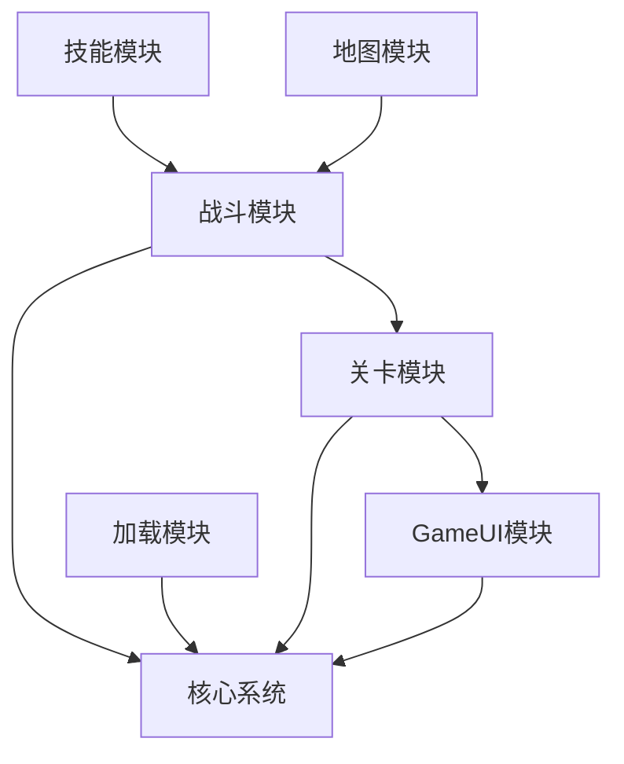

# 4. 模块系统设计

## 4.1 模块化架构

### 4.1.1 模块化设计理念

模块化设计将游戏功能划分为独立的模块，每个模块负责特定的功能领域，通过定义清晰的接口与其他模块通信，实现高内聚、低耦合的系统架构。

### 4.1.2 模块划分原则

1. **功能内聚性**：同一模块内的功能紧密相关
2. **接口简单性**：模块间通信接口简洁明了
3. **独立性**：模块可独立开发、测试和部署
4. **可替换性**：模块可独立升级或替换

### 4.1.3 模块层级结构

```
┌─────────────────────────────────────────┐
│              核心系统层                  │
│  (管理器、工具类、基础架构)             │
├─────────────────────────────────────────┤
│              功能模块层                  │
│  ┌───────────┐ ┌───────────┐ ┌───────────┐ │
│  │  战斗模块  │ │  关卡模块  │ │   UI模块   │ │
│  └───────────┘ └───────────┘ └───────────┘ │
│  ┌───────────┐ ┌───────────┐ ┌───────────┐ │
│  │ 加载模块  │ │ 技能模块  │ │ 地图模块  │ │
│  └───────────┘ └───────────┘ └───────────┘ │
└─────────────────────────────────────────┘
```

## 4.2 功能模块详解

### 4.2.1 战斗模块 (Fight)

#### 模块职责
- 战斗逻辑处理
- 角色行为控制
- 技能执行管理
- 战斗状态管理

#### 模块结构
```
Fight/
├── FightController.cs      // 战斗控制器
├── FightModel.cs          // 战斗数据模型
├── FightView.cs           // 战斗视图
├── FightManager/          // 战斗管理器
│   ├── FightManager.cs
│   ├── FightUnitBase.cs
│   ├── FightIdle.cs
│   ├── FightEnter.cs
│   ├── FightPlayerUnit.cs
│   ├── FightEnemyUnit.cs
│   └── FightGameOverUnit.cs
├── Command/               // 命令系统
│   ├── CommandManager.cs
│   ├── BaseCommand.cs
│   ├── MoveCommand.cs
│   ├── SkillCommand.cs
│   ├── AIMoveCommand.cs
│   └── ShowPathCommand.cs
├── Skill/                 // 技能系统
│   ├── SkillManager.cs
│   ├── ISkill.cs
│   ├── SkillHelper.cs
│   └── SkillProperty.cs
└── Component/             // 组件
    ├── HeroItem.cs
    ├── OptionItem.cs
    ├── Hero.cs
    └── Enemy.cs
```

#### 核心类说明

```csharp
// 战斗状态机
public class FightManager
{
    public GameState state = GameState.Idle;
    private FightUnitBase curr; // 当前战斗单元

    public void ChangeState(GameState state)
    {
        // 状态切换逻辑
    }

    public void EnterFight() { /* 进入战斗 */ }
    public void SpawnHero(Block b, Dictionary<string, string> data) { /* 生成英雄 */ }
    public void RemoveEnemy(Enemy enemy) { /* 移除敌人 */ }
}
```

### 4.2.2 关卡模块 (Level)

#### 模块职责
- 关卡数据管理
- 关卡进度控制
- 关卡解锁逻辑
- 玩家位置控制

#### 模块结构
```
Level/
├── LevelController.cs     // 关卡控制器
├── LevelModel.cs         // 关卡数据模型
├── SelectLevelView.cs    // 关卡选择视图
└── Component/
    ├── PlayerController.cs // 玩家控制器
    └── LevelEntry.cs       // 关卡入口
```

#### 核心功能

```csharp
public class LevelController : BaseController
{
    public override void Init()
    {
        _model = new LevelModel();
        // 注册关卡相关视图
        RegisterViews();
    }

    public void LoadLevel(int levelId) { /* 加载关卡 */ }
    public void UnlockLevel(int levelId) { /* 解锁关卡 */ }
    public void ResetLevel() { /* 重置关卡 */ }
}
```

### 4.2.3 UI模块 (GameUI)

#### 模块职责
- UI界面管理
- 用户交互处理
- 界面状态控制
- UI动画管理

#### 模块结构
```
GameUI/
├── GameUIController.cs    // UI控制器
├── BeginView.cs          // 开始界面
├── SettingsView.cs       // 设置界面
├── MessageView.cs        // 消息界面
└── Component/
    └── UI组件集合
```

#### 核心实现

```csharp
public class GameUIController : BaseController
{
    public void ShowMessage(string message) { /* 显示消息 */ }
    public void OpenSettings() { /* 打开设置 */ }
    public void CloseAllUI() { /* 关闭所有UI */ }
}
```

### 4.2.4 加载模块 (Load)

#### 模块职责
- 资源异步加载
- 进度显示管理
- 加载状态控制
- 内存管理

#### 模块结构
```
Load/
├── LoadController.cs     // 加载控制器
├── LoadModel.cs         // 加载数据模型
└── LoadView.cs          // 加载视图
```

#### 核心功能

```csharp
public class LoadController : BaseController
{
    public IEnumerator LoadAssetsAsync(List<string> assetPaths)
    {
        foreach (var path in assetPaths)
        {
            ResourceRequest request = Resources.LoadAsync(path);
            yield return request;
            // 更新加载进度
            UpdateProgress();
        }
    }
}
```

## 4.3 模块通信机制

### 4.3.1 事件驱动通信

```csharp
// 模块间通过事件进行松耦合通信
public class FightController : BaseController
{
    public void OnHeroDied(Hero hero)
    {
        // 发送英雄死亡事件
        GameApp.EventCenter.BroadcastEvent("HeroDied", hero);

        // 通知关卡模块更新状态
        GameApp.EventCenter.BroadcastEvent("UpdateLevelProgress");
    }
}

public class LevelController : BaseController
{
    public override void Init()
    {
        // 监听战斗模块事件
        GameApp.EventCenter.AddEvent("HeroDied", OnHeroDiedHandler);
    }

    private void OnHeroDiedHandler(object data)
    {
        // 处理英雄死亡逻辑
    }
}
```

### 4.3.2 控制器间直接调用

```csharp
// 通过ControllerManager进行控制器间通信
public class ModuleCommunication
{
    public void CallOtherModule()
    {
        // 调用战斗模块方法
        GameApp.ControllerManager.ApplyFunc(
            ControllerType.FightController,
            "StartFight",
            fightData
        );

        // 调用UI模块方法
        GameApp.ControllerManager.ApplyFunc(
            ControllerType.GameUIController,
            "ShowMessage",
            "战斗开始！"
        );
    }
}
```

### 4.3.3 数据共享机制

```csharp
// 通过GameApp访问共享数据
public class DataSharing
{
    public void ShareData()
    {
        // 访问游戏数据
        var gameData = GameApp.GameDataManager.GetGameData();

        // 访问配置数据
        var config = GameApp.ConfigManager.GetConfigData("hero_config");

        // 访问战斗数据
        var fightModel = GameApp.ControllerManager
            .GetControllerModel(ControllerType.FightController) as FightModel;
    }
}
```

## 4.4 模块生命周期管理

### 4.4.1 模块生命周期


### 4.4.2 生命周期管理实现

```csharp
public interface IModule
{
    void Initialize();      // 初始化
    void Activate();        // 激活
    void Update(float dt);  // 更新
    void Deactivate();      // 停用
    void Destroy();         // 销毁
}

public class ModuleLifecycleManager
{
    private List<IModule> _activeModules;

    public void RegisterModule(IModule module)
    {
        module.Initialize();
        _activeModules.Add(module);
    }

    public void UnregisterModule(IModule module)
    {
        module.Deactivate();
        module.Destroy();
        _activeModules.Remove(module);
    }

    public void UpdateAllModules(float dt)
    {
        foreach (var module in _activeModules)
        {
            module.Update(dt);
        }
    }
}
```

## 4.5 模块依赖管理

### 4.5.1 依赖关系图



### 4.5.2 依赖注入

```csharp
public class DependencyInjection
{
    // 模块间依赖通过接口注入
    public interface IFightService
    {
        void StartFight();
        void EndFight();
    }

    public class LevelModule
    {
        private readonly IFightService _fightService;

        public LevelModule(IFightService fightService)
        {
            _fightService = fightService;
        }

        public void StartLevelFight()
        {
            _fightService.StartFight();
        }
    }
}
```

## 4.6 模块热更新支持

### 4.6.1 动态模块加载

```csharp
public class HotUpdateManager
{
    public void LoadModule(string moduleName)
    {
        // 动态加载模块程序集
        Assembly assembly = Assembly.LoadFrom($"{moduleName}.dll");

        // 创建模块实例
        Type moduleType = assembly.GetType($"{moduleName}.{moduleName}Controller");
        BaseController controller = Activator.CreateInstance(moduleType) as BaseController;

        // 注册到控制器管理器
        GameApp.ControllerManager.Register(GetControllerType(moduleName), controller);
    }
}
```

### 4.6.2 模块版本管理

```csharp
public class ModuleVersion
{
    public string ModuleName { get; set; }
    public string Version { get; set; }
    public bool IsLoaded { get; set; }
    public DateTime LoadTime { get; set; }
}

public class ModuleManager
{
    private Dictionary<string, ModuleVersion> _moduleVersions;

    public bool CheckModuleUpdate(string moduleName, string newVersion)
    {
        // 检查模块是否需要更新
        return _moduleVersions[moduleName].Version != newVersion;
    }
}
```

## 4.7 模块测试策略

### 4.7.1 单元测试

```csharp
[TestClass]
public class FightModuleTests
{
    [TestMethod]
    public void TestFightStateTransition()
    {
        // 创建测试用的战斗管理器
        var fightManager = new FightManager();

        // 测试状态转换
        fightManager.ChangeState(GameState.Enter);
        Assert.AreEqual(GameState.Enter, fightManager.state);

        fightManager.ChangeState(GameState.Player);
        Assert.AreEqual(GameState.Player, fightManager.state);
    }
}
```

### 4.7.2 集成测试

```csharp
[TestClass]
public class ModuleIntegrationTests
{
    [TestMethod]
    public void TestModuleCommunication()
    {
        // 测试模块间通信
        var fightController = new FightController();
        var levelController = new LevelController();

        // 模拟事件发送和接收
        bool eventReceived = false;
        GameApp.EventCenter.AddEvent("TestEvent", (data) => { eventReceived = true; });

        GameApp.EventCenter.BroadcastEvent("TestEvent");

        Assert.IsTrue(eventReceived);
    }
}
```

## 总结

模块化设计为项目提供了良好的架构基础，通过清晰的职责划分和规范的通信机制，实现了系统的可扩展性和可维护性。每个模块都是独立的开发单元，支持并行开发和测试，大大提升了开发效率和代码质量。模块化的设计思想也为后续的功能扩展和系统升级奠定了坚实的基础。