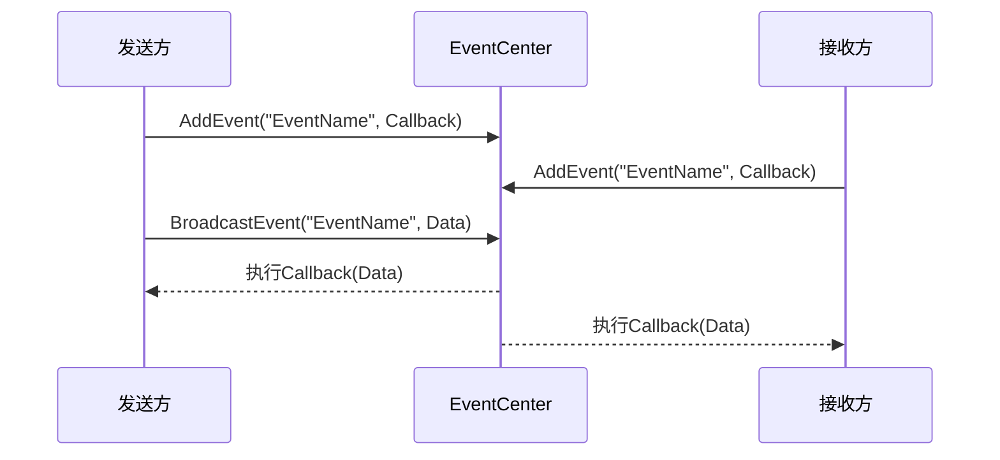

# 5. 事件系统

## 5.1 EventCenter设计

### 5.1.1 设计目标

事件系统采用观察者模式，实现模块间的松耦合通信，提供高效、灵活的消息传递机制，支持一对多、多对一的通信模式。

### 5.1.2 核心架构

```csharp
public class EventCenter
{
    private Dictionary<string, UnityAction<object>> eventDict;        // 普通事件字典
    private Dictionary<string, UnityAction<object>> tempEventDict;    // 临时事件字典
    private Dictionary<object, Dictionary<string, UnityAction<object>>> objEventDict; // 对象事件字典
}
```

### 5.1.3 事件类型分类

| 事件类型 | 存储位置 | 生命周期 | 使用场景 |
|---------|---------|---------|---------|
| 普通事件 | `eventDict` | 持久化 | 系统级事件、模块间通信 |
| 临时事件 | `tempEventDict` | 一次性 | 临时通知、异步回调 |
| 对象事件 | `objEventDict` | 跟随对象 | UI事件、组件通信 |

## 5.2 事件注册与触发

### 5.2.1 普通事件

```csharp
// 事件注册
public void AddEvent(string eventName, UnityAction<object> callback)
{
    if (eventDict.ContainsKey(eventName))
    {
        eventDict[eventName] += callback;
    }
    else
    {
        eventDict.Add(eventName, callback);
    }
}

// 事件触发
public void BroadcastEvent(string eventName, object arg = null)
{
    if (eventDict.ContainsKey(eventName))
    {
        eventDict[eventName]?.Invoke(arg);
    }
}

// 事件注销
public void RemoveEvent(string eventName, UnityAction<object> callback)
{
    if (eventDict.ContainsKey(eventName))
    {
        eventDict[eventName] -= callback;
        if (eventDict[eventName] == null)
        {
            eventDict.Remove(eventName);
        }
    }
}
```

### 5.2.2 临时事件

```csharp
// 注册临时事件（覆盖模式）
public void AddTempEvent(string eventName, UnityAction<object> callback)
{
    if (tempEventDict.ContainsKey(eventName))
    {
        tempEventDict[eventName] = callback; // 覆盖而不是累加
    }
    else
    {
        tempEventDict.Add(eventName, callback);
    }
}

// 触发临时事件（触发后自动移除）
public void BroadcastTempEvent(string eventName, object arg = null)
{
    if (tempEventDict.ContainsKey(eventName))
    {
        tempEventDict[eventName]?.Invoke(arg);
        tempEventDict[eventName] = null;
        tempEventDict.Remove(eventName);
    }
}
```

### 5.2.3 对象绑定事件

```csharp
// 绑定对象事件
public void AddEvent(object listener, string eventName, UnityAction<object> callback)
{
    if (objEventDict.ContainsKey(listener))
    {
        if (objEventDict[listener].ContainsKey(eventName))
        {
            objEventDict[listener][eventName] += callback;
        }
        else
        {
            objEventDict[listener].Add(eventName, callback);
        }
    }
    else
    {
        Dictionary<string, UnityAction<object>> tempDict = new() { { eventName, callback } };
        objEventDict.Add(listener, tempDict);
    }
}

// 触发对象事件
public void BroadcastEvent(object listener, string eventName, object arg = null)
{
    if (objEventDict.ContainsKey(listener))
    {
        if (objEventDict[listener].ContainsKey(eventName))
        {
            objEventDict[listener][eventName]?.Invoke(arg);
        }
    }
}

// 移除对象所有事件
public void RemoveObjAllEvent(object listener)
{
    if (objEventDict.ContainsKey(listener))
    {
        objEventDict.Remove(listener);
    }
}
```

## 5.3 事件通信流程

### 5.3.1 基本通信流程



### 5.3.2 异步事件处理

```csharp
public class AsyncEventExample
{
    public IEnumerator LoadDataAsync()
    {
        // 注册临时事件等待加载完成
        bool isLoaded = false;
        GameApp.EventCenter.AddTempEvent("DataLoaded", (data) =>
        {
            isLoaded = true;
        });

        // 开始异步加载
        StartCoroutine(LoadDataCoroutine());

        // 等待加载完成
        while (!isLoaded)
        {
            yield return null;
        }

        Debug.Log("数据加载完成");
    }

    private IEnumerator LoadDataCoroutine()
    {
        // 模拟异步加载
        yield return new WaitForSeconds(2f);

        // 加载完成后触发事件
        GameApp.EventCenter.BroadcastTempEvent("DataLoaded", loadedData);
    }
}
```

## 5.4 事件系统应用实例

### 5.4.1 战斗系统事件

```csharp
public class FightEvents
{
    // 战斗相关事件定义
    public const string FIGHT_START = "FightStart";
    public const string FIGHT_END = "FightEnd";
    public const string HERO_DIED = "HeroDied";
    public const string ENEMY_DIED = "EnemyDied";
    public const string ROUND_START = "RoundStart";
    public const string ROUND_END = "RoundEnd";
    public const string SKILL_CAST = "SkillCast";
}

// 战斗控制器使用事件
public class FightController : BaseController
{
    public override void Init()
    {
        // 注册事件监听
        GameApp.EventCenter.AddEvent(FightEvents.FIGHT_START, OnFightStart);
        GameApp.EventCenter.AddEvent(FightEvents.HERO_DIED, OnHeroDied);
    }

    public void StartFight()
    {
        // 触发战斗开始事件
        GameApp.EventCenter.BroadcastEvent(FightEvents.FIGHT_START, fightData);
    }

    private void OnFightStart(object data)
    {
        // 处理战斗开始逻辑
        var fightData = data as FightData;
        Debug.Log($"战斗开始: {fightData.FightId}");
    }

    private void OnHeroDied(object data)
    {
        var hero = data as Hero;
        Debug.Log($"英雄死亡: {hero.Name}");

        // 触发UI更新事件
        GameApp.EventCenter.BroadcastEvent("UpdateHeroUI", hero);
    }
}
```

### 5.4.2 UI系统事件

```csharp
public class UIEvents
{
    public const string SHOW_MESSAGE = "ShowMessage";
    public const string HIDE_MESSAGE = "HideMessage";
    public const string UPDATE_HP = "UpdateHP";
    public const string UPDATE_MP = "UpdateMP";
}

// UI控制器处理事件
public class GameUIController : BaseController
{
    public override void Init()
    {
        GameApp.EventCenter.AddEvent(UIEvents.SHOW_MESSAGE, OnShowMessage);
        GameApp.EventCenter.AddEvent(UIEvents.UPDATE_HP, OnUpdateHP);
    }

    private void OnShowMessage(object data)
    {
        var messageData = data as MessageData;
        GameApp.ViewManager.Open(ViewType.MessageView, messageData);
    }

    private void OnUpdateHP(object data)
    {
        var hpData = data as HPData;
        // 更新HP显示
        UpdateHPDisplay(hpData.CurrentHP, hpData.MaxHP);
    }
}
```

### 5.4.3 关卡系统事件

```csharp
public class LevelEvents
{
    public const string LEVEL_START = "LevelStart";
    public const string LEVEL_COMPLETE = "LevelComplete";
    public const string LEVEL_FAILED = "LevelFailed";
    public const string PROGRESS_UPDATE = "ProgressUpdate";
}

// 关卡控制器
public class LevelController : BaseController
{
    public void CompleteLevel(int levelId)
    {
        // 触发关卡完成事件
        var levelData = new LevelCompleteData
        {
            LevelId = levelId,
            Stars = CalculateStars(),
            Score = GetScore()
        };

        GameApp.EventCenter.BroadcastEvent(LevelEvents.LEVEL_COMPLETE, levelData);
    }

    public override void Init()
    {
        GameApp.EventCenter.AddEvent(LevelEvents.LEVEL_START, OnLevelStart);
        GameApp.EventCenter.AddEvent(FightEvents.FIGHT_END, OnFightEnd);
    }

    private void OnFightEnd(object data)
    {
        // 战斗结束，检查关卡是否完成
        if (IsLevelComplete())
        {
            CompleteLevel(CurrentLevelId);
        }
    }
}
```

## 5.5 事件系统性能优化

### 5.5.1 事件缓存机制

```csharp
public class OptimizedEventCenter
{
    private Dictionary<string, List<UnityAction<object>>> _eventCache;
    private Dictionary<string, bool> _eventActiveStatus;

    // 批量注册事件
    public void BatchRegisterEvents(object listener, Dictionary<string, UnityAction<object>> events)
    {
        foreach (var evt in events)
        {
            AddEvent(listener, evt.Key, evt.Value);
        }
    }

    // 批量注销事件
    public void BatchUnregisterEvents(object listener, List<string> eventNames)
    {
        foreach (var eventName in eventNames)
        {
            RemoveEvent(listener, eventName, null);
        }
    }

    // 事件激活/停用控制
    public void SetEventActive(string eventName, bool active)
    {
        _eventActiveStatus[eventName] = active;
    }

    public void BroadcastEvent(string eventName, object arg = null)
    {
        if (_eventActiveStatus.ContainsKey(eventName) && !_eventActiveStatus[eventName])
        {
            return; // 事件被停用
        }

        // 正常触发事件
        base.BroadcastEvent(eventName, arg);
    }
}
```

### 5.5.2 事件参数优化

```csharp
// 使用结构体减少GC
public struct EventData
{
    public int IntValue;
    public float FloatValue;
    public string StringValue;
    public Vector3 Position;
}

// 对象池管理事件参数
public class EventDataPool
{
    private static Queue<EventData> _pool = new Queue<EventData>();

    public static EventData Get()
    {
        if (_pool.Count > 0)
        {
            return _pool.Dequeue();
        }
        return new EventData();
    }

    public static void Release(EventData data)
    {
        // 重置数据
        data.IntValue = 0;
        data.FloatValue = 0f;
        data.StringValue = null;
        _pool.Enqueue(data);
    }
}
```

## 5.6 事件调试与监控

### 5.6.1 事件日志系统

```csharp
public class EventDebugger
{
    private static List<EventLog> _eventLogs = new List<EventLog>();
    private static bool _isDebugMode = true;

    [System.Serializable]
    public class EventLog
    {
        public string EventName;
        public DateTime Timestamp;
        public string Caller;
        public object Data;
        public int ListenerCount;
    }

    public static void LogEvent(string eventName, object data, int listenerCount)
    {
        if (!_isDebugMode) return;

        var log = new EventLog
        {
            EventName = eventName,
            Timestamp = DateTime.Now,
            Caller = GetCallerName(),
            Data = data,
            ListenerCount = listenerCount
        };

        _eventLogs.Add(log);

        // 保持日志数量在合理范围内
        if (_eventLogs.Count > 1000)
        {
            _eventLogs.RemoveAt(0);
        }
    }

    public static List<EventLog> GetEventLogs()
    {
        return new List<EventLog>(_eventLogs);
    }
}
```

### 5.6.2 事件性能监控

```csharp
public class EventPerformanceMonitor
{
    private static Dictionary<string, EventStats> _eventStats = new Dictionary<string, EventStats>();

    public class EventStats
    {
        public string EventName;
        public int TriggerCount;
        public float TotalTime;
        public float AverageTime;
        public DateTime LastTrigger;
    }

    public static void RecordEventTime(string eventName, float deltaTime)
    {
        if (!_eventStats.ContainsKey(eventName))
        {
            _eventStats[eventName] = new EventStats { EventName = eventName };
        }

        var stats = _eventStats[eventName];
        stats.TriggerCount++;
        stats.TotalTime += deltaTime;
        stats.AverageTime = stats.TotalTime / stats.TriggerCount;
        stats.LastTrigger = DateTime.Now;
    }

    public static void PrintEventStats()
    {
        foreach (var stats in _eventStats.Values)
        {
            Debug.Log($"事件: {stats.EventName}, " +
                     $"触发次数: {stats.TriggerCount}, " +
                     $"平均耗时: {stats.AverageTime:F4}ms");
        }
    }
}
```

## 5.7 事件系统最佳实践

### 5.7.1 事件命名规范

```csharp
// 使用常量定义事件名称，避免拼写错误
public static class GameEvents
{
    // 战斗事件
    public const string FIGHT_START = "Fight.Start";
    public const string FIGHT_END = "Fight.End";
    public const string FIGHT_ROUND_START = "Fight.Round.Start";

    // UI事件
    public const string UI_SHOW = "UI.Show";
    public const string UI_HIDE = "UI.Hide";

    // 系统事件
    public const string SYSTEM_PAUSE = "System.Pause";
    public const string SYSTEM_RESUME = "System.Resume";
}
```

### 5.7.2 事件使用建议

1. **避免循环引用**：确保事件发送方和接收方不会形成循环依赖
2. **及时清理监听**：对象销毁时要注销相关事件监听
3. **参数序列化**：复杂参数考虑序列化，便于调试
4. **性能监控**：对频繁触发的事件进行性能监控
5. **错误处理**：事件处理中添加适当的错误处理机制

## 总结

事件系统为项目提供了强大的松耦合通信能力，通过统一的事件管理中心，实现了模块间的高效协作。合理的事件分类、优化的性能设计以及完善的调试工具，使得事件系统既灵活又高效，为大型游戏项目的架构提供了坚实的基础。