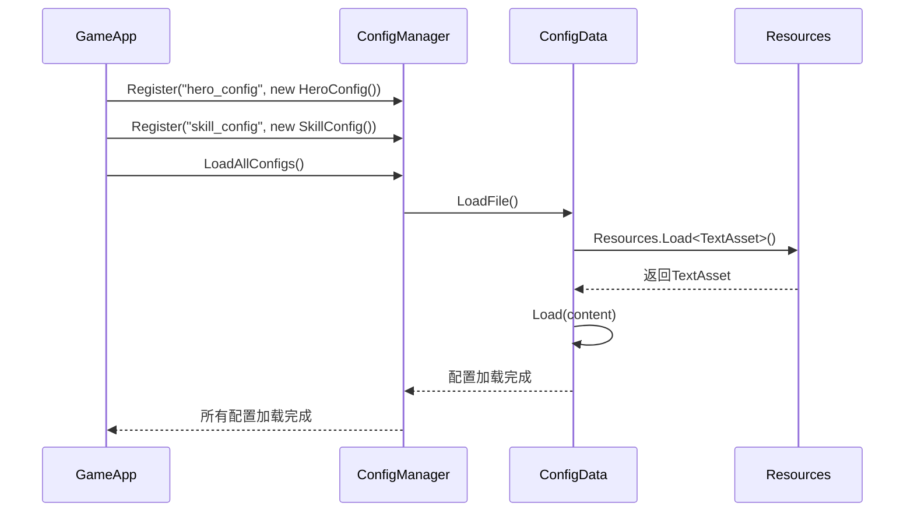

# 6. 配置系统

## 6.1 ConfigManager设计

### 6.1.1 系统架构

配置系统采用分层设计，统一管理游戏中所有配置文件，支持多种格式的配置数据，提供高效的读取和缓存机制。

```csharp
public class ConfigManager
{
    private Dictionary<string, ConfigData> configs;     // 已加载的配置表
    private Dictionary<string, ConfigData> toLoadList;  // 待加载的配置表

    // 配置注册和加载
    public void Register(string file, ConfigData config);
    public void LoadAllConfigs();
    public ConfigData GetConfigData(string file);
}
```

### 6.1.2 配置数据基类

```csharp
public abstract class ConfigData
{
    protected Dictionary<string, Dictionary<string, object>> _dataTable;

    public ConfigData()
    {
        _dataTable = new Dictionary<string, Dictionary<string, object>>();
    }

    // 抽象方法，子类必须实现
    public abstract TextAsset LoadFile();           // 加载配置文件
    public abstract void Load(string content);      // 解析配置内容

    // 通用数据访问方法
    public T GetValue<T>(string rowKey, string columnKey)
    {
        if (_dataTable.ContainsKey(rowKey) && _dataTable[rowKey].ContainsKey(columnKey))
        {
            return (T)_dataTable[rowKey][columnKey];
        }
        return default(T);
    }

    public Dictionary<string, object> GetRow(string rowKey)
    {
        if (_dataTable.ContainsKey(rowKey))
        {
            return _dataTable[rowKey];
        }
        return null;
    }

    public List<string> GetAllRowKeys()
    {
        return _dataTable.Keys.ToList();
    }
}
```

## 6.2 配置文件管理

### 6.2.1 配置类型定义

```csharp
// 英雄配置
public class HeroConfig : ConfigData
{
    public override TextAsset LoadFile()
    {
        return Resources.Load<TextAsset>("Config/hero_config");
    }

    public override void Load(string content)
    {
        // 解析CSV格式的英雄配置
        var lines = content.Split('\n');
        for (int i = 1; i < lines.Length; i++) // 跳过标题行
        {
            var values = lines[i].Split(',');
            if (values.Length >= 6)
            {
                string heroId = values[0];
                _dataTable[heroId] = new Dictionary<string, object>
                {
                    {"Name", values[1]},
                    {"HP", int.Parse(values[2])},
                    {"Attack", int.Parse(values[3])},
                    {"Defense", int.Parse(values[4])},
                    {"Speed", float.Parse(values[5])}
                };
            }
        }
    }

    // 专用访问方法
    public string GetHeroName(string heroId) => GetValue<string>(heroId, "Name");
    public int GetHeroHP(string heroId) => GetValue<int>(heroId, "HP");
    public int GetHeroAttack(string heroId) => GetValue<int>(heroId, "Attack");
}

// 技能配置
public class SkillConfig : ConfigData
{
    public override TextAsset LoadFile()
    {
        return Resources.Load<TextAsset>("Config/skill_config");
    }

    public override void Load(string content)
    {
        // 解析JSON格式的技能配置
        var skillData = JsonUtility.FromJson<SkillConfigData>(content);
        foreach (var skill in skillData.skills)
        {
            _dataTable[skill.id] = new Dictionary<string, object>
            {
                {"Name", skill.name},
                {"Damage", skill.damage},
                {"Range", skill.range},
                {"Cooldown", skill.cooldown},
                {"Effect", skill.effect}
            };
        }
    }
}

[System.Serializable]
public class SkillConfigData
{
    public SkillInfo[] skills;
}

[System.Serializable]
public class SkillInfo
{
    public string id;
    public string name;
    public int damage;
    public float range;
    public float cooldown;
    public string effect;
}
```

### 6.2.2 配置文件示例

#### CSV格式 - hero_config.csv
```csv
ID,Name,HP,Attack,Defense,Speed
hero_001,剑士,100,25,15,1.2
hero_002,法师,80,35,8,1.0
hero_003,弓手,90,30,12,1.5
hero_004,牧师,85,20,18,0.9
```

#### JSON格式 - skill_config.json
```json
{
    "skills": [
        {
            "id": "skill_001",
            "name": "火球术",
            "damage": 40,
            "range": 3.0,
            "cooldown": 2.0,
            "effect": "fire_ball"
        },
        {
            "id": "skill_002",
            "name": "治疗术",
            "damage": -30,
            "range": 2.0,
            "cooldown": 3.0,
            "effect": "heal"
        }
    ]
}
```

## 6.3 数据加载机制

### 6.3.1 配置注册流程



### 6.3.2 异步加载实现

```csharp
public class AsyncConfigManager
{
    private Dictionary<string, ConfigData> _loadedConfigs;
    private List<string> _loadingQueue;
    private bool _isLoading;

    public IEnumerator LoadConfigsAsync(List<string> configFiles)
    {
        _isLoading = true;
        _loadingQueue = new List<string>(configFiles);

        foreach (string configFile in configFiles)
        {
            yield return StartCoroutine(LoadSingleConfigAsync(configFile));
        }

        _isLoading = false;
        OnAllConfigsLoaded();
    }

    private IEnumerator LoadSingleConfigAsync(string configFile)
    {
        // 异步加载配置文件
        ResourceRequest request = Resources.LoadAsync<TextAsset>($"Config/{configFile}");
        yield return request;

        if (request.asset != null)
        {
            TextAsset textAsset = request.asset as TextAsset;
            ConfigData configData = CreateConfigData(configFile);
            configData.Load(textAsset.text);
            _loadedConfigs[configFile] = configData;
        }
    }

    private ConfigData CreateConfigData(string configFile)
    {
        switch (configFile)
        {
            case "hero_config": return new HeroConfig();
            case "skill_config": return new SkillConfig();
            case "level_config": return new LevelConfig();
            default: return new DefaultConfig();
        }
    }
}
```

## 6.4 配置数据访问

### 6.4.1 基础数据访问

```csharp
public class ConfigDataAccess
{
    // 获取英雄配置
    public static HeroConfig GetHeroConfig()
    {
        return GameApp.ConfigManager.GetConfigData("hero_config") as HeroConfig;
    }

    // 获取技能配置
    public static SkillConfig GetSkillConfig()
    {
        return GameApp.ConfigManager.GetConfigData("skill_config") as SkillConfig;
    }

    // 安全的配置访问
    public static T GetConfigValue<T>(string configName, string rowKey, string columnKey, T defaultValue = default)
    {
        var config = GameApp.ConfigManager.GetConfigData(configName);
        if (config != null)
        {
            try
            {
                return config.GetValue<T>(rowKey, columnKey);
            }
            catch (Exception e)
            {
                Debug.LogError($"配置读取错误: {configName}[{rowKey}][{columnKey}] - {e.Message}");
            }
        }
        return defaultValue;
    }
}
```

### 6.4.2 配置数据缓存

```csharp
public class ConfigCache
{
    private static Dictionary<string, object> _cache = new Dictionary<string, object>();
    private static Dictionary<string, DateTime> _cacheTime = new Dictionary<string, DateTime>();
    private static readonly TimeSpan CACHE_EXPIRE_TIME = TimeSpan.FromMinutes(5);

    public static T GetCachedConfig<T>(string key, Func<T> loader)
    {
        // 检查缓存是否存在且未过期
        if (_cache.ContainsKey(key) && _cacheTime.ContainsKey(key))
        {
            if (DateTime.Now - _cacheTime[key] < CACHE_EXPIRE_TIME)
            {
                return (T)_cache[key];
            }
        }

        // 重新加载并缓存
        T data = loader();
        _cache[key] = data;
        _cacheTime[key] = DateTime.Now;

        return data;
    }

    public static void ClearCache()
    {
        _cache.Clear();
        _cacheTime.Clear();
    }

    public static void ClearExpiredCache()
    {
        var expiredKeys = _cacheTime.Where(kv => DateTime.Now - kv.Value >= CACHE_EXPIRE_TIME)
                                   .Select(kv => kv.Key).ToList();

        foreach (string key in expiredKeys)
        {
            _cache.Remove(key);
            _cacheTime.Remove(key);
        }
    }
}
```

## 6.5 配置系统扩展

### 6.5.1 动态配置更新

```csharp
public class DynamicConfigUpdater
{
    public void UpdateConfigFromServer(string configName, string jsonData)
    {
        ConfigData config = GameApp.ConfigManager.GetConfigData(configName);
        if (config != null)
        {
            // 备份原有配置
            BackupConfig(configName);

            // 更新配置数据
            config.Load(jsonData);

            // 触发配置更新事件
            GameApp.EventCenter.BroadcastEvent("ConfigUpdated", configName);
        }
    }

    private void BackupConfig(string configName)
    {
        ConfigData config = GameApp.ConfigManager.GetConfigData(configName);
        if (config != null)
        {
            string backupPath = $"Backup/{configName}_{DateTime.Now:yyyyMMdd_HHmmss}.backup";
            // 保存备份文件
            SaveBackupFile(backupPath, config);
        }
    }
}
```

### 6.5.2 配置验证机制

```csharp
public class ConfigValidator
{
    public static bool ValidateHeroConfig(HeroConfig config)
    {
        var errors = new List<string>();

        foreach (string heroId in config.GetAllRowKeys())
        {
            // 验证必填字段
            if (string.IsNullOrEmpty(config.GetHeroName(heroId)))
            {
                errors.Add($"英雄 {heroId} 名称不能为空");
            }

            // 验证数值范围
            int hp = config.GetHeroHP(heroId);
            if (hp <= 0 || hp > 10000)
            {
                errors.Add($"英雄 {heroId} HP值超出范围: {hp}");
            }

            int attack = config.GetHeroAttack(heroId);
            if (attack <= 0 || attack > 1000)
            {
                errors.Add($"英雄 {heroId} 攻击力超出范围: {attack}");
            }
        }

        if (errors.Count > 0)
        {
            Debug.LogError("英雄配置验证失败:\n" + string.Join("\n", errors));
            return false;
        }

        return true;
    }

    public static bool ValidateAllConfigs()
    {
        bool isValid = true;

        // 验证所有配置
        var heroConfig = GameApp.ConfigManager.GetConfigData("hero_config") as HeroConfig;
        if (heroConfig != null)
        {
            isValid &= ValidateHeroConfig(heroConfig);
        }

        // 添加其他配置验证...

        return isValid;
    }
}
```

## 6.6 配置系统性能优化

### 6.6.1 延迟加载策略

```csharp
public class LazyConfigLoader
{
    private Dictionary<string, Lazy<ConfigData>> _lazyConfigs;

    public LazyConfigLoader()
    {
        _lazyConfigs = new Dictionary<string, Lazy<ConfigData>>();

        // 注册延迟加载的配置
        _lazyConfigs["hero_config"] = new Lazy<ConfigData>(() => LoadHeroConfig());
        _lazyConfigs["skill_config"] = new Lazy<ConfigData>(() => LoadSkillConfig());
    }

    public T GetConfig<T>(string configName) where T : ConfigData
    {
        if (_lazyConfigs.ContainsKey(configName))
        {
            return _lazyConfigs[configName].Value as T;
        }
        return null;
    }

    private ConfigData LoadHeroConfig()
    {
        var config = new HeroConfig();
        var textAsset = Resources.Load<TextAsset>("Config/hero_config");
        config.Load(textAsset.text);
        return config;
    }
}
```

### 6.6.2 配置数据索引

```csharp
public class ConfigIndexManager
{
    private Dictionary<string, Dictionary<object, string>> _indexes;

    public void BuildIndex<T>(ConfigData config, string columnName)
    {
        var index = new Dictionary<object, string>();

        foreach (string rowKey in config.GetAllRowKeys())
        {
            T value = config.GetValue<T>(rowKey, columnName);
            if (!index.ContainsKey(value))
            {
                index[value] = rowKey;
            }
        }

        _indexes[$"{config.GetType().Name}_{columnName}"] = index;
    }

    public string FindRowByIndex<T>(string configName, string columnName, T value)
    {
        string indexKey = $"{configName}_{columnName}";
        if (_indexes.ContainsKey(indexKey) && _indexes[indexKey].ContainsKey(value))
        {
            return _indexes[indexKey][value];
        }
        return null;
    }
}
```

## 总结

配置系统为游戏提供了灵活、高效的数据管理方案。通过统一的配置管理器、多样的数据格式支持、完善的缓存机制和强大的扩展能力，配置系统既满足了当前项目的需求，也为未来的功能扩展预留了充足的空间。合理的性能优化设计确保了配置数据的快速访问，为游戏的流畅运行提供了保障。