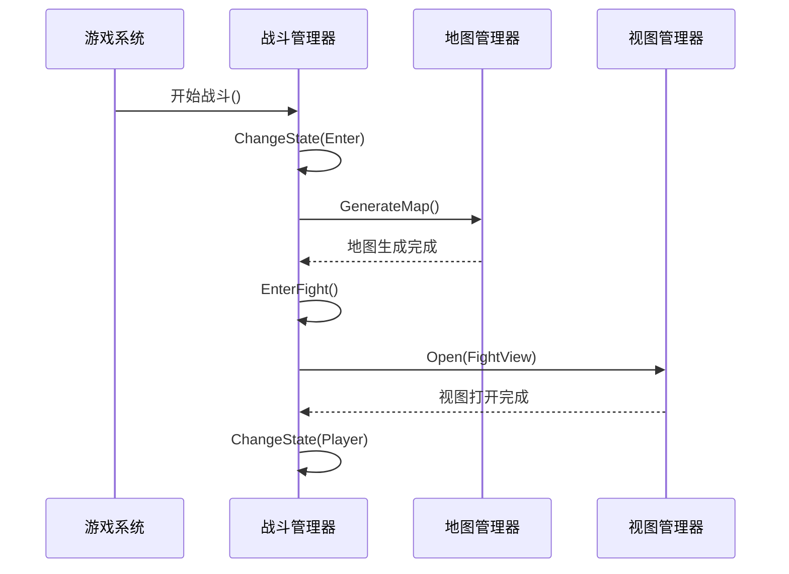
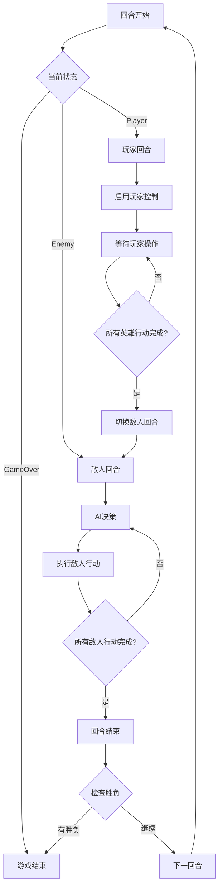

# 7. 战斗系统

## 7.1 战斗管理器

### 7.1.1 核心架构

战斗系统采用状态机设计模式，通过`FightManager`统一管理战斗流程，协调各个战斗实体和子系统的工作。

```csharp
public class FightManager
{
    public GameState state = GameState.Idle;
    private FightUnitBase curr; // 当前战斗单元

    public List<Hero> heros;      // 英雄列表
    public List<Enemy> enemies;   // 敌人列表
    public int round;            // 回合数

    public void ChangeState(GameState state);
    public void EnterFight();
    public void SpawnHero(Block b, Dictionary<string, string> data);
    public void RemoveEnemy(Enemy enemy);
    public void RemoveHero(Hero hero);
}
```

### 7.1.2 战斗状态枚举

```csharp
public enum GameState
{
    Idle,     // 空闲状态
    Enter,    // 进入战斗
    Player,   // 玩家回合
    Enemy,    // 敌人回合
    GameOver, // 游戏结束
}
```

## 7.2 战斗状态机

### 7.2.1 战斗单元基类

```csharp
public abstract class FightUnitBase
{
    protected float timer;           // 计时器
    protected float duration;        // 持续时间
    protected bool isComplete;       // 是否完成

    public virtual void Init() { }
    public virtual bool Update(float dt)
    {
        timer += dt;
        if (timer >= duration)
        {
            isComplete = true;
            OnComplete();
        }
        return isComplete;
    }
    public virtual void OnComplete() { }
    public virtual void Reset() { timer = 0; isComplete = false; }
}
```

### 7.2.2 具体状态实现

#### 空闲状态
```csharp
public class FightIdle : FightUnitBase
{
    public override void Init()
    {
        duration = 0.1f;
        base.Init();
    }

    public override void OnComplete()
    {
        // 空闲状态完成后切换到进入状态
        GameApp.FightManager.ChangeState(GameState.Enter);
    }
}
```

#### 进入战斗状态
```csharp
public class FightEnter : FightUnitBase
{
    public override void Init()
    {
        duration = 2.0f;
        base.Init();

        // 初始化战斗场景
        GameApp.MapManager.GenerateMap();
        GameApp.FightManager.EnterFight();

        // 显示战斗开始UI
        GameApp.ViewManager.Open(ViewType.FightView);
    }

    public override void OnComplete()
    {
        // 进入玩家回合
        GameApp.FightManager.ChangeState(GameState.Player);
    }
}
```

#### 玩家回合状态
```csharp
public class FightPlayerUnit : FightUnitBase
{
    private int currentHeroIndex = 0;

    public override void Init()
    {
        base.Init();
        currentHeroIndex = 0;
        EnablePlayerControl();
    }

    public override bool Update(float dt)
    {
        // 检查当前英雄是否完成行动
        if (currentHeroIndex < GameApp.FightManager.heros.Count)
        {
            Hero currentHero = GameApp.FightManager.heros[currentHeroIndex];
            if (currentHero.HasActed)
            {
                currentHeroIndex++;
                if (currentHeroIndex >= GameApp.FightManager.heros.Count)
                {
                    // 所有英雄完成行动，进入敌人回合
                    isComplete = true;
                }
            }
        }
        return isComplete;
    }

    public override void OnComplete()
    {
        GameApp.FightManager.ChangeState(GameState.Enemy);
    }

    private void EnablePlayerControl()
    {
        GameApp.UserInputManager.EnableInput();
        GameApp.ViewManager.Open(ViewType.DragHeroView);
    }
}
```

#### 敌人回合状态
```csharp
public class FightEnemyUnit : FightUnitBase
{
    private int currentEnemyIndex = 0;
    private float aiThinkingTime = 0.5f;

    public override void Init()
    {
        base.Init();
        currentEnemyIndex = 0;
        aiThinkingTime = 0.5f;
    }

    public override bool Update(float dt)
    {
        aiThinkingTime -= dt;

        if (aiThinkingTime <= 0)
        {
            if (currentEnemyIndex < GameApp.FightManager.enemies.Count)
            {
                Enemy currentEnemy = GameApp.FightManager.enemies[currentEnemyIndex];
                ExecuteAIAction(currentEnemy);
                currentEnemyIndex++;
                aiThinkingTime = 0.5f; // 重置思考时间
            }
            else
            {
                isComplete = true;
            }
        }

        return isComplete;
    }

    private void ExecuteAIAction(Enemy enemy)
    {
        // AI决策逻辑
        var nearestHero = GameApp.FightManager.GetMinDisHero(enemy);
        if (nearestHero != null)
        {
            // 移动到攻击范围或执行攻击
            if (enemy.CanAttack(nearestHero))
            {
                enemy.Attack(nearestHero);
            }
            else
            {
                // 移动到攻击位置
                var moveCommand = new AIMoveCommand(enemy, nearestHero);
                GameApp.CommandManager.AddCommand(moveCommand);
            }
        }
    }

    public override void OnComplete()
    {
        // 回合结束，重置所有单位状态
        GameApp.FightManager.ResetHeros();
        GameApp.FightManager.ResetEnemies();

        // 进入下一回合
        GameApp.FightManager.round++;
        GameApp.FightManager.ChangeState(GameState.Player);
    }
}
```

## 7.3 战斗实体管理

### 7.3.1 战斗实体基类

```csharp
public abstract class ModelBase
{
    public int rowIndex;           // 行索引
    public int colIndex;           // 列索引
    public string id;             // 唯一标识
    public int hp;                // 生命值
    public int maxHp;             // 最大生命值
    public bool IsStop { get; set; } // 是否停止行动

    public virtual void Init(Dictionary<string, string> data, Block block) { }
    public virtual void Update(float dt) { }
    public virtual void TakeDamage(int damage) { }
    public virtual void Die() { }

    public float GetDist(ModelBase other)
    {
        int dx = Mathf.Abs(rowIndex - other.rowIndex);
        int dy = Mathf.Abs(colIndex - other.colIndex);
        return Mathf.Sqrt(dx * dx + dy * dy);
    }

    public bool IsDead => hp <= 0;
}
```

### 7.3.2 英雄实现

```csharp
public class Hero : ModelBase
{
    public string heroType;       // 英雄类型
    public int attack;            // 攻击力
    public int defense;           // 防御力
    public float speed;           // 移动速度
    public List<ISkill> skills;   // 技能列表
    public bool HasActed { get; set; } // 是否已行动

    public override void Init(Dictionary<string, string> data, Block block)
    {
        base.Init(data, block);

        rowIndex = block.rowIndex;
        colIndex = block.colIndex;
        id = data["ID"];
        heroType = data["Type"];

        // 从配置加载属性
        var heroConfig = ConfigDataAccess.GetHeroConfig();
        maxHp = hp = heroConfig.GetHeroHP(id);
        attack = heroConfig.GetHeroAttack(id);
        defense = heroConfig.GetHeroDefense(id);
        speed = heroConfig.GetHeroSpeed(id);

        skills = new List<ISkill>();
        LoadSkills();
    }

    public void MoveTo(Block targetBlock)
    {
        if (CanMoveTo(targetBlock))
        {
            // 更新位置
            GameApp.MapManager.ChangeBlockType(rowIndex, colIndex, BlockType.Null);
            rowIndex = targetBlock.rowIndex;
            colIndex = targetBlock.colIndex;
            GameApp.MapManager.ChangeBlockType(rowIndex, colIndex, BlockType.Obstacle);

            // 执行移动动画
            ExecuteMoveAnimation(targetBlock);
            HasActed = true;
        }
    }

    public void Attack(ModelBase target)
    {
        if (CanAttack(target))
        {
            int damage = CalculateDamage(target);
            target.TakeDamage(damage);

            // 显示伤害数字
            Vector3 hitPos = new Vector3(target.colIndex, target.rowIndex, 0);
            GameApp.ViewManager.ShowHitNum(damage.ToString(), Color.red, hitPos);

            HasActed = true;
        }
    }

    public void UseSkill(ISkill skill, ModelBase target = null)
    {
        if (skill.CanUse(this, target))
        {
            skill.Execute(this, target);
            HasActed = true;
        }
    }

    private bool CanMoveTo(Block block)
    {
        // 检查移动范围
        float distance = GetDist(block);
        return distance <= speed && block.type == BlockType.Null;
    }

    private bool CanAttack(ModelBase target)
    {
        // 检查攻击距离
        float distance = GetDist(target);
        return distance <= 1.5f; // 基础攻击距离
    }

    private int CalculateDamage(ModelBase target)
    {
        int baseDamage = attack;
        int defense = target is Hero hero ? hero.defense : 0;
        int finalDamage = Mathf.Max(1, baseDamage - defense);
        return finalDamage;
    }
}
```

### 7.3.3 敌人实现

```csharp
public class Enemy : ModelBase
{
    public string enemyType;      // 敌人类型
    public int attack;            // 攻击力
    public float detectionRange;  // 侦测范围
    public float attackRange;     // 攻击范围

    public override void Init(Dictionary<string, string> data, Block block)
    {
        base.Init(data, block);

        rowIndex = block.rowIndex;
        colIndex = block.colIndex;
        id = Guid.NewGuid().ToString();
        enemyType = data["Type"];

        // 从配置加载敌人属性
        LoadEnemyData();
    }

    private void LoadEnemyData()
    {
        // 根据敌人类型加载对应配置
        switch (enemyType)
        {
            case "Orc":
                maxHp = hp = 80;
                attack = 20;
                detectionRange = 5.0f;
                attackRange = 1.5f;
                break;
            case "Goblin":
                maxHp = hp = 60;
                attack = 15;
                detectionRange = 4.0f;
                attackRange = 1.0f;
                break;
            default:
                maxHp = hp = 100;
                attack = 25;
                detectionRange = 6.0f;
                attackRange = 2.0f;
                break;
        }
    }

    public override void TakeDamage(int damage)
    {
        hp = Mathf.Max(0, hp - damage);

        // 播放受击动画
        PlayHitAnimation();

        if (IsDead)
        {
            Die();
        }
    }

    public override void Die()
    {
        // 移除敌人
        GameApp.FightManager.RemoveEnemy(this);

        // 播放死亡动画
        PlayDeathAnimation();

        // 触发死亡事件
        GameApp.EventCenter.BroadcastEvent("EnemyDied", this);
    }

    public bool CanAttack(ModelBase target)
    {
        float distance = GetDist(target);
        return distance <= attackRange;
    }

    public void Attack(ModelBase target)
    {
        if (CanAttack(target))
        {
            int damage = CalculateDamage(target);
            target.TakeDamage(damage);

            // 显示伤害数字
            Vector3 hitPos = new Vector3(target.colIndex, target.rowIndex, 0);
            GameApp.ViewManager.ShowHitNum(damage.ToString(), Color.red, hitPos);
        }
    }

    private int CalculateDamage(ModelBase target)
    {
        return Mathf.Max(1, attack + Random.Range(-5, 6)); // 伤害浮动
    }
}
```

## 7.4 技能系统

### 7.4.1 技能接口

```csharp
public interface ISkill
{
    string SkillId { get; }
    string SkillName { get; }
    float Cooldown { get; }
    float Range { get; }

    bool CanUse(ModelBase caster, ModelBase target);
    void Execute(ModelBase caster, ModelBase target);
    void Update(float dt);
}
```

### 7.4.2 技能管理器

```csharp
public class SkillManager
{
    private Dictionary<string, ISkill> _skills;
    private Dictionary<string, float> _cooldowns;

    public SkillManager()
    {
        _skills = new Dictionary<string, ISkill>();
        _cooldowns = new Dictionary<string, float>();
        RegisterSkills();
    }

    public void Update(float dt)
    {
        // 更新技能冷却
        var keysToRemove = new List<string>();
        foreach (var cooldown in _cooldowns)
        {
            _cooldowns[cooldown.Key] -= dt;
            if (_cooldowns[cooldown.Key] <= 0)
            {
                keysToRemove.Add(cooldown.Key);
            }
        }

        foreach (string key in keysToRemove)
        {
            _cooldowns.Remove(key);
        }
    }

    public void RegisterSkill(ISkill skill)
    {
        if (!_skills.ContainsKey(skill.SkillId))
        {
            _skills.Add(skill.SkillId, skill);
        }
    }

    public ISkill GetSkill(string skillId)
    {
        return _skills.ContainsKey(skillId) ? _skills[skillId] : null;
    }

    public bool IsSkillReady(string skillId)
    {
        return !_cooldowns.ContainsKey(skillId);
    }

    public void UseSkill(string skillId, ModelBase caster, ModelBase target)
    {
        if (IsSkillReady(skillId) && _skills.ContainsKey(skillId))
        {
            ISkill skill = _skills[skillId];
            if (skill.CanUse(caster, target))
            {
                skill.Execute(caster, target);
                _cooldowns[skillId] = skill.Cooldown;
            }
        }
    }
}
```

### 7.4.3 具体技能实现

```csharp
// 火球术技能
public class FireballSkill : ISkill
{
    public string SkillId => "fireball";
    public string SkillName => "火球术";
    public float Cooldown => 3.0f;
    public float Range => 4.0f;

    public bool CanUse(ModelBase caster, ModelBase target)
    {
        if (target == null) return false;
        float distance = caster.GetDist(target);
        return distance <= Range;
    }

    public void Execute(ModelBase caster, ModelBase target)
    {
        // 计算伤害
        int damage = 40 + Random.Range(-10, 11);

        // 对目标造成伤害
        target.TakeDamage(damage);

        // 播放技能特效
        PlayFireballEffect(caster, target);

        // 显示伤害数字
        Vector3 hitPos = new Vector3(target.colIndex, target.rowIndex, 0);
        GameApp.ViewManager.ShowHitNum(damage.ToString(), Color.red, hitPos);
    }

    public void Update(float dt) { }

    private void PlayFireballEffect(ModelBase caster, ModelBase target)
    {
        // 创建火球特效
        GameObject fireball = GameObject.Instantiate(
            Resources.Load<GameObject>("Effect/fireball"),
            new Vector3(caster.colIndex, caster.rowIndex, 0),
            Quaternion.identity
        );

        // 设置火球目标
        FireballController controller = fireball.GetComponent<FireballController>();
        controller.SetTarget(new Vector3(target.colIndex, target.rowIndex, 0));
    }
}

// 治疗术技能
public class HealSkill : ISkill
{
    public string SkillId => "heal";
    public string SkillName => "治疗术";
    public float Cooldown => 5.0f;
    public float Range => 2.0f;

    public bool CanUse(ModelBase caster, ModelBase target)
    {
        // 可以治疗自己或队友
        return target != null && (target == caster || target is Hero);
    }

    public void Execute(ModelBase caster, ModelBase target)
    {
        // 恢复生命值
        int healAmount = 30;
        target.hp = Mathf.Min(target.maxHp, target.hp + healAmount);

        // 播放治疗特效
        PlayHealEffect(target);

        // 显示治疗数字
        Vector3 healPos = new Vector3(target.colIndex, target.rowIndex, 0);
        GameApp.ViewManager.ShowHitNum($"+{healAmount}", Color.green, healPos);
    }

    public void Update(float dt) { }

    private void PlayHealEffect(ModelBase target)
    {
        // 创建治疗特效
        GameObject healEffect = GameObject.Instantiate(
            Resources.Load<GameObject>("Effect/heal"),
            new Vector3(target.colIndex, target.rowIndex, 0),
            Quaternion.identity
        );

        // 设置特效持续时间
        Destroy(healEffect, 2.0f);
    }
}
```

## 7.5 战斗流程控制

### 7.5.1 战斗开始流程



### 7.5.2 回合制流程



## 总结

战斗系统采用了状态机设计模式，通过清晰的层次结构和模块化设计，实现了复杂的回合制战斗逻辑。系统具有良好的扩展性，支持多种战斗状态、丰富的技能系统和智能的AI行为，为游戏体验提供了坚实的技术基础。