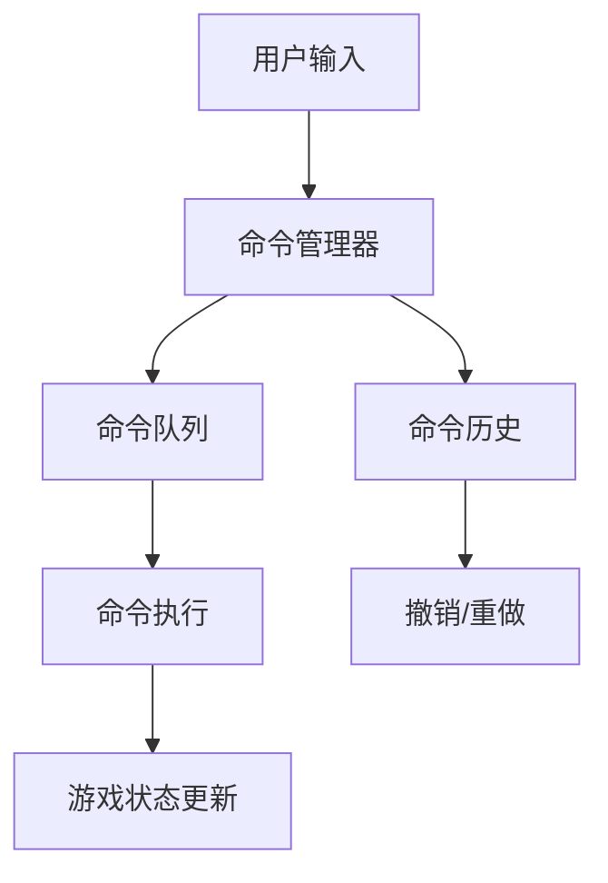

# 8. 命令系统

## 8.1 命令模式设计

### 8.1.1 设计目标

命令系统采用命令模式，将游戏中的各种操作封装为独立的命令对象，实现操作的队列化、可撤销化和日志化，提供灵活的操作管理和回滚机制。

### 8.1.2 命令系统架构



## 8.2 CommandManager实现

### 8.2.1 命令管理器核心

```csharp
public class CommandManager
{
    private Queue<BaseCommand> _commandQueue;        // 命令队列
    private Stack<BaseCommand> _executedCommands;   // 已执行命令栈
    private Stack<BaseCommand> _undoCommands;       // 撤销命令栈
    private float _commandInterval;                 // 命令执行间隔
    private float _timer;                          // 计时器

    public int MaxHistoryCount = 50;               // 历史记录最大数量
    public float CommandInterval = 0.1f;           // 命令执行间隔

    public CommandManager()
    {
        _commandQueue = new Queue<BaseCommand>();
        _executedCommands = new Stack<BaseCommand>();
        _undoCommands = new Stack<BaseCommand>();
        _commandInterval = CommandInterval;
        _timer = 0f;
    }

    public void Update(float dt)
    {
        _timer += dt;

        // 按时间间隔执行命令
        if (_timer >= _commandInterval && _commandQueue.Count > 0)
        {
            ExecuteNextCommand();
            _timer = 0f;
        }
    }

    // 添加命令到队列
    public void AddCommand(BaseCommand command)
    {
        _commandQueue.Enqueue(command);

        // 清空撤销栈（新命令会破坏重做链）
        _undoCommands.Clear();
    }

    // 执行下一个命令
    private void ExecuteNextCommand()
    {
        if (_commandQueue.Count > 0)
        {
            BaseCommand command = _commandQueue.Dequeue();
            ExecuteCommand(command);
        }
    }

    // 执行单个命令
    private void ExecuteCommand(BaseCommand command)
    {
        if (command.CanExecute())
        {
            command.Execute();
            _executedCommands.Push(command);

            // 限制历史记录数量
            if (_executedCommands.Count > MaxHistoryCount)
            {
                // 移除最旧的命令（这里可以添加持久化逻辑）
                var tempList = _executedCommands.ToList();
                _executedCommands.Clear();
                for (int i = tempList.Count - MaxHistoryCount; i < tempList.Count; i++)
                {
                    _executedCommands.Push(tempList[i]);
                }
            }

            // 触发命令执行事件
            GameApp.EventCenter.BroadcastEvent("CommandExecuted", command);
        }
    }

    // 撤销上一个命令
    public bool UndoLastCommand()
    {
        if (_executedCommands.Count > 0)
        {
            BaseCommand command = _executedCommands.Pop();
            command.Undo();
            _undoCommands.Push(command);

            // 触发撤销事件
            GameApp.EventCenter.BroadcastEvent("CommandUndone", command);
            return true;
        }
        return false;
    }

    // 重做上一个撤销的命令
    public bool RedoLastCommand()
    {
        if (_undoCommands.Count > 0)
        {
            BaseCommand command = _undoCommands.Pop();
            command.Execute();
            _executedCommands.Push(command);

            // 触发重做事件
            GameApp.EventCenter.BroadcastEvent("CommandRedone", command);
            return true;
        }
        return false;
    }

    // 清空所有命令
    public void ClearAllCommands()
    {
        _commandQueue.Clear();
        _executedCommands.Clear();
        _undoCommands.Clear();
    }

    // 获取命令统计信息
    public CommandStats GetStats()
    {
        return new CommandStats
        {
            QueuedCount = _commandQueue.Count,
            ExecutedCount = _executedCommands.Count,
            UndoCount = _undoCommands.Count
        };
    }
}

public class CommandStats
{
    public int QueuedCount { get; set; }
    public int ExecutedCount { get; set; }
    public int UndoCount { get; set; }
}
```

## 8.3 命令基类设计

### 8.3.1 基础命令类

```csharp
public abstract class BaseCommand
{
    protected DateTime ExecuteTime { get; set; }
    protected bool IsExecuted { get; set; }
    protected string CommandId { get; set; }

    public BaseCommand()
    {
        CommandId = Guid.NewGuid().ToString();
    }

    // 检查命令是否可以执行
    public virtual bool CanExecute()
    {
        return !IsExecuted;
    }

    // 执行命令
    public virtual void Execute()
    {
        if (CanExecute())
        {
            ExecuteTime = DateTime.Now;
            IsExecuted = true;
            OnExecute();
        }
    }

    // 撤销命令
    public virtual void Undo()
    {
        if (IsExecuted)
        {
            OnUndo();
            IsExecuted = false;
        }
    }

    // 子类重写的具体执行逻辑
    protected abstract void OnExecute();

    // 子类重写的撤销逻辑
    protected virtual void OnUndo() { }

    // 获取命令描述
    public virtual string GetDescription()
    {
        return GetType().Name;
    }
}
```

## 8.4 具体命令实现

### 8.4.1 移动命令

```csharp
public class MoveCommand : BaseCommand
{
    private ModelBase _character;
    private Block _fromBlock;
    private Block _toBlock;
    private Vector3 _fromPosition;
    private Vector3 _toPosition;

    public MoveCommand(ModelBase character, Block toBlock)
    {
        _character = character;
        _toBlock = toBlock;
        _fromBlock = GameApp.MapManager.GetBlock(character.rowIndex, character.colIndex);
        _fromPosition = _character.transform.position;
        _toPosition = new Vector3(toBlock.colIndex, toBlock.rowIndex, -1);
    }

    public override bool CanExecute()
    {
        // 检查目标位置是否可移动
        return base.CanExecute() &&
               _toBlock != null &&
               _toBlock.type == BlockType.Null &&
               IsValidMove();
    }

    protected override void OnExecute()
    {
        // 更新地图状态
        GameApp.MapManager.ChangeBlockType(_fromBlock.rowIndex, _fromBlock.colIndex, BlockType.Null);
        GameApp.MapManager.ChangeBlockType(_toBlock.rowIndex, _toBlock.colIndex, BlockType.Obstacle);

        // 更新角色位置
        _character.rowIndex = _toBlock.rowIndex;
        _character.colIndex = _toBlock.colIndex;

        // 执行移动动画
        ExecuteMoveAnimation();

        // 触发移动事件
        GameApp.EventCenter.BroadcastEvent("CharacterMoved", new object[] { _character, _fromBlock, _toBlock });
    }

    protected override void OnUndo()
    {
        // 恢复地图状态
        GameApp.MapManager.ChangeBlockType(_fromBlock.rowIndex, _fromBlock.colIndex, BlockType.Obstacle);
        GameApp.MapManager.ChangeBlockType(_toBlock.rowIndex, _toBlock.colIndex, BlockType.Null);

        // 恢复角色位置
        _character.rowIndex = _fromBlock.rowIndex;
        _character.colIndex = _fromBlock.colIndex;
        _character.transform.position = _fromPosition;

        // 触发撤销事件
        GameApp.EventCenter.BroadcastEvent("CharacterMoveUndone", new object[] { _character, _fromBlock, _toBlock });
    }

    private bool IsValidMove()
    {
        // 检查移动距离是否在允许范围内
        int dx = Mathf.Abs(_fromBlock.rowIndex - _toBlock.rowIndex);
        int dy = Mathf.Abs(_fromBlock.colIndex - _toBlock.colIndex);
        float distance = Mathf.Sqrt(dx * dx + dy * dy);
        return distance <= _character.speed;
    }

    private void ExecuteMoveAnimation()
    {
        // 使用DOTween执行平滑移动
        _character.transform.DOMove(_toPosition, 0.5f)
            .SetEase(Ease.OutQuad)
            .OnComplete(() => {
                // 移动完成回调
                GameApp.EventCenter.BroadcastEvent("MoveAnimationComplete", _character);
            });
    }

    public override string GetDescription()
    {
        return $"{_character.id} 移动到 ({_toBlock.rowIndex}, {_toBlock.colIndex})";
    }
}
```

### 8.4.2 技能命令

```csharp
public class SkillCommand : BaseCommand
{
    private ModelBase _caster;
    private ModelBase _target;
    private ISkill _skill;
    private int _originalTargetHp;
    private Vector3 _effectPosition;

    public SkillCommand(ModelBase caster, ISkill skill, ModelBase target = null)
    {
        _caster = caster;
        _skill = skill;
        _target = target;
        _effectPosition = target != null ?
            new Vector3(target.colIndex, target.rowIndex, 0) :
            new Vector3(caster.colIndex, caster.rowIndex, 0);
    }

    public override bool CanExecute()
    {
        return base.CanExecute() &&
               _skill != null &&
               _skill.CanUse(_caster, _target) &&
               GameApp.SkillManager.IsSkillReady(_skill.SkillId);
    }

    protected override void OnExecute()
    {
        // 记录目标原始生命值用于撤销
        if (_target != null)
        {
            _originalTargetHp = _target.hp;
        }

        // 执行技能
        _skill.Execute(_caster, _target);

        // 触发技能事件
        GameApp.EventCenter.BroadcastEvent("SkillUsed", new object[] { _caster, _skill, _target });

        // 播放技能特效
        PlaySkillEffect();
    }

    protected override void OnUndo()
    {
        // 恢复目标生命值
        if (_target != null)
        {
            _target.hp = _originalTargetHp;
        }

        // 触发技能撤销事件
        GameApp.EventCenter.BroadcastEvent("SkillUndone", new object[] { _caster, _skill, _target });

        // 播放撤销特效
        PlayUndoEffect();
    }

    private void PlaySkillEffect()
    {
        // 根据技能类型播放对应特效
        string effectPath = GetSkillEffectPath(_skill.SkillId);
        if (!string.IsNullOrEmpty(effectPath))
        {
            GameObject effect = GameObject.Instantiate(
                Resources.Load<GameObject>(effectPath),
                _effectPosition,
                Quaternion.identity
            );

            // 设置特效持续时间
            Destroy(effect, 3.0f);
        }
    }

    private void PlayUndoEffect()
    {
        // 播放撤销特效（可选）
        GameObject undoEffect = GameObject.Instantiate(
            Resources.Load<GameObject>("Effect/undo"),
            _effectPosition,
            Quaternion.identity
        );

        Destroy(undoEffect, 1.0f);
    }

    private string GetSkillEffectPath(string skillId)
    {
        return skillId switch
        {
            "fireball" => "Effect/fireball_explosion",
            "heal" => "Effect/heal_effect",
            "lightning" => "Effect/lightning_effect",
            _ => null
        };
    }

    public override string GetDescription()
    {
        string targetInfo = _target != null ? $" 对 {_target.id}" : "";
        return $"{_caster.id} 使用 {_skill.SkillName}{targetInfo}";
    }
}
```

### 8.4.3 AI移动命令

```csharp
public class AIMoveCommand : BaseCommand
{
    private Enemy _enemy;
    private ModelBase _target;
    private List<Block> _path;
    private int _currentPathIndex;
    private Vector3 _originalPosition;

    public AIMoveCommand(Enemy enemy, ModelBase target)
    {
        _enemy = enemy;
        _target = target;
        _originalPosition = enemy.transform.position;
        _currentPathIndex = 0;
    }

    public override bool CanExecute()
    {
        return base.CanExecute() &&
               _enemy != null &&
               _target != null &&
               !_enemy.IsDead &&
               !_target.IsDead;
    }

    protected override void OnExecute()
    {
        // 计算到目标的最短路径
        _path = CalculatePath();

        if (_path != null && _path.Count > 1)
        {
            // 移动到路径的下一个位置
            MoveAlongPath();
        }
        else
        {
            // 直接攻击目标
            AttackTarget();
        }
    }

    protected override void OnUndo()
    {
        // 恢复敌人位置
        _enemy.transform.position = _originalPosition;

        Block originalBlock = GameApp.MapManager.GetBlock(
            Mathf.RoundToInt(_originalPosition.y),
            Mathf.RoundToInt(_originalPosition.x)
        );

        if (originalBlock != null)
        {
            _enemy.rowIndex = originalBlock.rowIndex;
            _enemy.colIndex = originalBlock.colIndex;
            GameApp.MapManager.ChangeBlockType(_enemy.rowIndex, _enemy.colIndex, BlockType.Obstacle);
        }
    }

    private List<Block> CalculatePath()
    {
        // 使用A*算法计算路径
        var startBlock = GameApp.MapManager.GetBlock(_enemy.rowIndex, _enemy.colIndex);
        var endBlock = GameApp.MapManager.GetBlock(_target.rowIndex, _target.colIndex);

        return GameApp.AStar.FindPath(startBlock, endBlock);
    }

    private void MoveAlongPath()
    {
        if (_currentPathIndex < _path.Count)
        {
            Block nextBlock = _path[_currentPathIndex];

            // 创建移动命令
            var moveCommand = new MoveCommand(_enemy, nextBlock);
            GameApp.CommandManager.AddCommand(moveCommand);

            _currentPathIndex++;
        }
    }

    private void AttackTarget()
    {
        // 如果敌人可以攻击目标，则执行攻击
        if (_enemy.CanAttack(_target))
        {
            _enemy.Attack(_target);
        }
    }

    public override string GetDescription()
    {
        return $"{_enemy.id} AI移动到目标 {_target.id} 附近";
    }
}
```

## 8.5 命令系统高级特性

### 8.5.1 命令组合

```csharp
public class CompositeCommand : BaseCommand
{
    private List<BaseCommand> _commands;
    private bool _executeSequentially;

    public CompositeCommand(bool executeSequentially = true)
    {
        _commands = new List<BaseCommand>();
        _executeSequentially = executeSequentially;
    }

    public void AddCommand(BaseCommand command)
    {
        _commands.Add(command);
    }

    public override bool CanExecute()
    {
        return _commands.All(cmd => cmd.CanExecute());
    }

    protected override void OnExecute()
    {
        if (_executeSequentially)
        {
            // 顺序执行
            foreach (var command in _commands)
            {
                if (command.CanExecute())
                {
                    command.Execute();
                }
            }
        }
        else
        {
            // 并行执行（添加到命令队列）
            foreach (var command in _commands)
            {
                GameApp.CommandManager.AddCommand(command);
            }
        }
    }

    protected override void OnUndo()
    {
        // 逆序撤销
        for (int i = _commands.Count - 1; i >= 0; i--)
        {
            if (_commands[i].IsExecuted)
            {
                _commands[i].Undo();
            }
        }
    }

    public override string GetDescription()
    {
        return $"组合命令 ({_commands.Count} 个子命令)";
    }
}
```

### 8.5.2 命令条件

```csharp
public class ConditionalCommand : BaseCommand
{
    private BaseCommand _command;
    private Func<bool> _condition;
    private string _conditionDescription;

    public ConditionalCommand(BaseCommand command, Func<bool> condition, string conditionDesc = "")
    {
        _command = command;
        _condition = condition;
        _conditionDescription = conditionDesc;
    }

    public override bool CanExecute()
    {
        return _condition != null && _condition() && _command.CanExecute();
    }

    protected override void OnExecute()
    {
        if (CanExecute())
        {
            _command.Execute();
        }
    }

    protected override void OnUndo()
    {
        if (_command.IsExecuted)
        {
            _command.Undo();
        }
    }

    public override string GetDescription()
    {
        string conditionInfo = string.IsNullOrEmpty(_conditionDescription) ? "" : $" (条件: {_conditionDescription})";
        return $"{_command.GetDescription()}{conditionInfo}";
    }
}
```

## 8.6 命令系统应用示例

### 8.6.1 批量操作

```csharp
public class BatchOperationExample
{
    public void MoveMultipleCharacters()
    {
        var compositeCommand = new CompositeCommand();

        // 添加多个移动命令
        foreach (var hero in GameApp.FightManager.heros)
        {
            Block targetBlock = FindNearestEmptyBlock(hero);
            if (targetBlock != null)
            {
                compositeCommand.AddCommand(new MoveCommand(hero, targetBlock));
            }
        }

        // 执行批量移动
        GameApp.CommandManager.AddCommand(compositeCommand);
    }

    public void ConditionalSkillCast()
    {
        var hero = GameApp.FightManager.heros[0];
        var skill = GameApp.SkillManager.GetSkill("heal");
        var target = FindLowestHpHero();

        // 只有当目标生命值低于50%时才使用治疗技能
        var conditionCommand = new ConditionalCommand(
            new SkillCommand(hero, skill, target),
            () => target != null && (float)target.hp / target.maxHp < 0.5f,
            "目标生命值低于50%"
        );

        GameApp.CommandManager.AddCommand(conditionCommand);
    }
}
```

## 总结

命令系统为游戏提供了强大的操作管理机制，通过命令模式实现了操作的封装、队列化和可撤销化。系统支持复杂的命令组合、条件执行和批量操作，为游戏逻辑的灵活性和可维护性提供了重要支撑。命令系统还与事件系统紧密结合，实现了操作与反馈的解耦，大大提升了系统的扩展性。