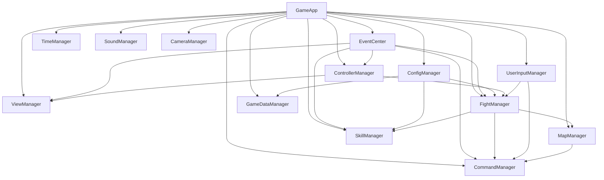
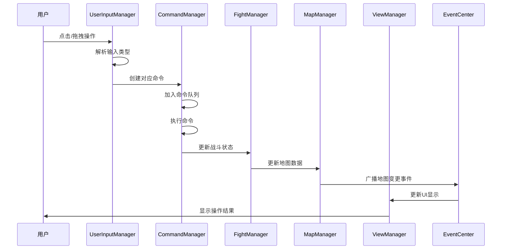
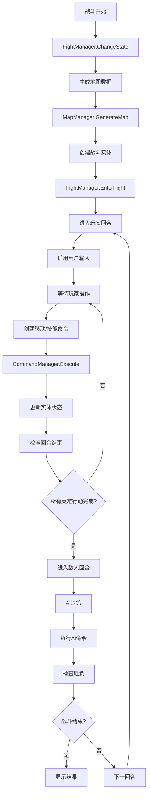
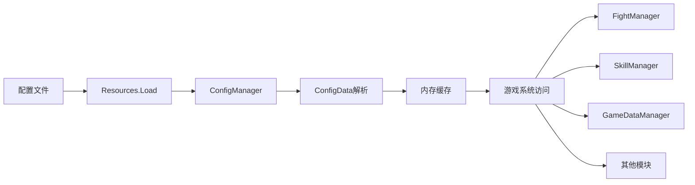

# 10. 系统交互关系

## 10.1 系统依赖图

### 10.1.1 核心系统依赖关系



### 10.1.2 模块间依赖矩阵

| 系统 | 依赖系统 | 被依赖系统 | 通信方式 |
|------|----------|------------|----------|
| GameApp | 无 | 所有系统 | 直接访问 |
| EventCenter | 无 | 所有系统 | 事件广播 |
| ConfigManager | 无 | GameDataManager, FightManager | 数据提供 |
| ControllerManager | EventCenter | ViewManager, 所有控制器 | 方法调用 |
| ViewManager | ControllerManager, EventCenter | UI系统 | 视图管理 |
| FightManager | MapManager, EventCenter, CommandManager | 战斗系统 | 状态管理 |
| MapManager | 无 | FightManager, CommandManager | 地图服务 |
| CommandManager | EventCenter | 所有命令 | 命令执行 |
| SkillManager | EventCenter | FightManager | 技能管理 |

## 10.2 数据流向分析

### 10.2.1 用户输入处理流程



### 10.2.2 战斗流程数据流



### 10.2.3 配置数据流向



## 10.3 通信机制详解

### 10.3.1 事件通信模式

#### 一对一通信
```csharp
// 直接对象事件绑定
public class DirectCommunicationExample
{
    private void SetupDirectEvent()
    {
        // UI组件直接绑定到控制器
        GameApp.EventCenter.AddEvent(this, "ButtonClicked", OnButtonClicked);
    }

    private void OnButtonClicked(object data)
    {
        // 处理按钮点击
        Debug.Log("按钮被点击: " + data);
    }

    private void Cleanup()
    {
        // 清理时移除事件
        GameApp.EventCenter.RemoveObjAllEvent(this);
    }
}
```

#### 一对多通信
```csharp
// 全局事件广播
public class BroadcastCommunicationExample
{
    public void SendGlobalEvent()
    {
        // 广播全局事件，所有监听者都会收到
        GameApp.EventCenter.BroadcastEvent("GameStateChanged", new GameStateData
        {
            OldState = GameState.Idle,
            NewState = GameState.Player,
            Timestamp = Time.time
        });
    }

    public void ListenToGlobalEvent()
    {
        // 多个系统监听同一事件
        GameApp.EventCenter.AddEvent("GameStateChanged", OnGameStateChanged);
    }

    private void OnGameStateChanged(object data)
    {
        var stateData = data as GameStateData;
        Debug.Log($"游戏状态改变: {stateData.OldState} -> {stateData.NewState}");
    }
}
```

#### 多对一通信
```csharp
// 多个事件源向同一目标发送事件
public class MultiToSingleCommunication
{
    public void SetupMultiSourceEvents()
    {
        // UI系统监听多个来源的事件
        GameApp.EventCenter.AddEvent("HeroMoved", OnHeroAction);
        GameApp.EventCenter.AddEvent("HeroAttacked", OnHeroAction);
        GameApp.EventCenter.AddEvent("HeroUsedSkill", OnHeroAction);
    }

    private void OnHeroAction(object data)
    {
        // 统一处理英雄相关事件
        UpdateHeroUI();
        PlayHeroAnimation();
        UpdateCameraPosition();
    }
}
```

### 10.3.2 直接调用模式

#### 管理器间直接调用
```csharp
public class DirectCallExample
{
    public void ExecuteDirectCalls()
    {
        // 通过GameApp直接访问其他管理器
        GameApp.FightManager.EnterFight();
        GameApp.ViewManager.Open(ViewType.FightView);
        GameApp.SoundManager.PlaySound("battle_start");
        GameApp.CameraManager.Shake(0.5f);
    }
}
```

#### 控制器间调用
```csharp
public class ControllerCommunication
{
    public void CallOtherController()
    {
        // 通过ControllerManager调用其他控制器的方法
        GameApp.ControllerManager.ApplyFunc(
            ControllerType.FightController,
            "StartFight",
            fightData
        );

        GameApp.ControllerManager.ApplyFunc(
            ControllerType.GameUIController,
            "ShowMessage",
            "战斗即将开始！"
        );
    }
}
```

### 10.3.3 数据共享模式

#### 全局数据访问
```csharp
public class DataSharingExample
{
    public void AccessGlobalData()
    {
        // 访问游戏数据
        var gameData = GameApp.GameDataManager.GetGameData();

        // 访问配置数据
        var heroConfig = GameApp.ConfigManager.GetConfigData("hero_config") as HeroConfig;

        // 访问战斗数据
        var fightModel = GameApp.ControllerManager
            .GetControllerModel(ControllerType.FightController) as FightModel;

        // 访问地图数据
        var currentMap = GameApp.MapManager.GetCurrentMap();
    }
}
```

#### 数据同步机制
```csharp
public class DataSynchronization
{
    private void SyncDataBetweenSystems()
    {
        // 当战斗数据更新时，同步到UI和其他系统
        GameApp.EventCenter.BroadcastEvent("FightDataUpdated", new FightDataUpdate
        {
            Heroes = GameApp.FightManager.heros,
            Enemies = GameApp.FightManager.enemies,
            CurrentRound = GameApp.FightManager.round,
            GameState = GameApp.FightManager.state
        });
    }

    private void OnFightDataUpdated(object data)
    {
        var update = data as FightDataUpdate;

        // UI系统更新显示
        UpdateHeroUI(update.Heroes);
        UpdateEnemyUI(update.Enemies);
        UpdateRoundDisplay(update.CurrentRound);

        // 相机系统调整视角
        AdjustCameraForBattleState(update.GameState);

        // 音效系统播放对应音效
        PlayStateTransitionSound(update.GameState);
    }
}
```

## 10.4 系统交互实例

### 10.4.1 完整战斗流程交互

```csharp
public class CompleteBattleFlow
{
    public void ExecuteBattleSequence()
    {
        // 1. 战斗开始
        GameApp.EventCenter.BroadcastEvent("BattleStart", battleData);

        // 2. 地图系统生成战斗地图
        GameApp.MapManager.GenerateRandomMap(10, 8);

        // 3. 战斗管理器初始化
        GameApp.FightManager.EnterFight();

        // 4. 视图管理器显示战斗界面
        GameApp.ViewManager.Open(ViewType.FightView);

        // 5. 音效管理器播放战斗音乐
        GameApp.SoundManager.PlayBGM("battle_theme");

        // 6. 相机管理器调整到战斗视角
        GameApp.CameraManager.SetBattleMode(true);

        // 7. 进入玩家回合
        GameApp.FightManager.ChangeState(GameState.Player);

        // 8. 启用用户输入
        GameApp.UserInputManager.EnableInput();
    }

    public void HandlePlayerAction()
    {
        // 1. 用户输入管理器接收输入
        Vector2 inputPosition = GameApp.UserInputManager.GetTouchPosition();

        // 2. 转换为地图坐标
        Block targetBlock = GameApp.MapManager.GetBlockFromWorldPosition(inputPosition);

        // 3. 创建移动命令
        var moveCommand = new MoveCommand(selectedHero, targetBlock);

        // 4. 命令管理器执行命令
        GameApp.CommandManager.AddCommand(moveCommand);

        // 5. 战斗管理器更新状态
        GameApp.FightManager.UpdateHeroState(selectedHero);

        // 6. 视图管理器更新UI
        GameApp.ViewManager.UpdateHeroPosition(selectedHero);

        // 7. 地图管理器更新显示
        GameApp.MapManager.HighlightReachableBlocks(selectedHero);

        // 8. 触发移动完成事件
        GameApp.EventCenter.BroadcastEvent("HeroMoved", selectedHero);
    }
}
```

### 10.4.2 UI与游戏逻辑交互

```csharp
public class UIGameLogicInteraction
{
    // UI控制器
    public class GameUIController : BaseController
    {
        public void OnStartButtonClicked()
        {
            // 1. 显示加载界面
            GameApp.ViewManager.Open(ViewType.LoadView);

            // 2. 通知游戏控制器开始游戏
            GameApp.ControllerManager.ApplyFunc(
                ControllerType.GameController,
                "StartNewGame"
            );

            // 3. 播放按钮音效
            GameApp.SoundManager.PlaySound("button_click");
        }

        public void OnSettingsButtonClicked()
        {
            // 1. 打开设置界面
            GameApp.ViewManager.Open(ViewType.SettingsView);

            // 2. 暂停游戏
            GameApp.EventCenter.BroadcastEvent("GamePause");
        }
    }

    // 游戏控制器
    public class GameController : BaseController
    {
        public override void Init()
        {
            // 监听UI事件
            GameApp.EventCenter.AddEvent("StartButtonClicked", OnStartButtonClicked);
            GameApp.EventCenter.AddEvent("GamePause", OnGamePause);
        }

        private void OnStartButtonClicked(object data)
        {
            // 1. 初始化游戏数据
            GameApp.GameDataManager.InitializeNewGame();

            // 2. 加载配置
            GameApp.ConfigManager.LoadAllConfigs();

            // 3. 进入主菜单
            GameApp.ControllerManager.ApplyFunc(
                ControllerType.LevelController,
                "ShowLevelSelect"
            );
        }

        private void OnGamePause(object data)
        {
            // 1. 暂停游戏时间
            GameApp.TimeManager.Pause();

            // 2. 暂停所有动画
            GameApp.EventCenter.BroadcastEvent("PauseAllAnimations");

            // 3. 显示暂停界面
            GameApp.ViewManager.Open(ViewType.PauseView);
        }
    }
}
```

## 10.5 系统通信最佳实践

### 10.5.1 通信规范

1. **事件命名规范**
   ```csharp
   // 使用分层命名
   public static class EventNames
   {
       // 战斗相关事件
       public const string BATTLE_START = "Battle.Start";
       public const string BATTLE_END = "Battle.End";
       public const string BATTLE_ROUND_START = "Battle.Round.Start";

       // UI相关事件
       public const string UI_SHOW = "UI.Show";
       public const string UI_HIDE = "UI.Hide";

       // 系统相关事件
       public const string SYSTEM_PAUSE = "System.Pause";
       public const string SYSTEM_RESUME = "System.Resume";
   }
   ```

2. **数据传递规范**
   ```csharp
   // 使用结构体传递复杂数据
   public struct BattleEventData
   {
       public string BattleId;
       public List<Hero> Heroes;
       public List<Enemy> Enemies;
       public int RoundNumber;
       public GameState CurrentState;
       public float Timestamp;
   }
   ```

3. **错误处理规范**
   ```csharp
   public class SafeCommunication
   {
       public void SafeEventBroadcast(string eventName, object data)
       {
           try
           {
               GameApp.EventCenter.BroadcastEvent(eventName, data);
           }
           catch (Exception e)
           {
               Debug.LogError($"事件广播失败: {eventName} - {e.Message}");
               // 记录错误日志
               LogError(eventName, data, e);
           }
       }

       public void SafeMethodCall<T>(Action<T> action, T param)
       {
           try
           {
               action?.Invoke(param);
           }
           catch (Exception e)
           {
               Debug.LogError($"方法调用失败: {action.Method.Name} - {e.Message}");
           }
       }
   }
   ```

### 10.5.2 性能优化建议

1. **事件系统优化**
   - 避免频繁触发同一事件
   - 使用事件聚合减少调用次数
   - 及时清理不需要的事件监听

2. **数据传递优化**
   - 使用对象池减少GC
   - 避免传递过大的数据结构
   - 使用引用传递而不是值传递

3. **调用频率控制**
   - 对高频调用进行节流
   - 批量处理多个操作
   - 使用缓存减少重复计算

## 总结

系统交互关系是整个游戏架构的核心，通过清晰的分层设计、规范化的通信机制和合理的数据流向控制，实现了各个系统之间的高效协作。事件驱动的设计理念确保了系统的松耦合性，而直接调用模式则为性能敏感的操作提供了快速通道。合理的交互设计既保证了系统的灵活性，又确保了运行效率，为大型游戏项目的稳定运行提供了重要保障。